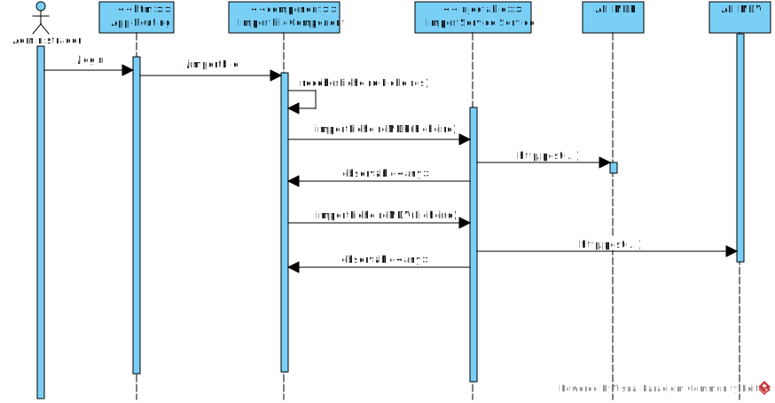

**US64 - [SPA] Importar viagens, serviços de viatura e serviços de tripulante**
==========================================================

# 1. Requisitos

US64 - [SPA] Como data administrator quero importar viagens, serviços de viatura e serviços de tripulante

## 1.1 Requisitos adicionais do cliente

* `a hora de inicio da viagem é a hora do primeiro (cronologicamente) ponto de passagem (elementos PassingTime)`

* `No ficheiro disponibilizado como exemplo para a importação existem algumas viagens que não referenciam linhas (por exemplo, a viagem com a key Trip:436). Mas referenciam percurso e como um percurso apenas é utilizado numa única linha é possível complementar essa informação se ela estiver em falta`

# 2. Análise

## 2.1. Glossário de conceitos

* **Data Administrator**: utilizador do caso de uso. É ele o responsável por definir um percurso no sistema.

**Serviço de viatura** | Um serviço de viatura corresponde ao período de trabalho diário de uma viatura. Um serviço é definido como uma sequência de blocos de trabalho obedecendo a um conjunto de regras.

**Serviço de tripulante** | Um serviço de tripulante corresponde ao período diário de trabalho de um tripulante. Um serviço é definido como uma sequência de blocos de trabalho obedecendo a um conjunto de regras.

**Viagem** | Uma viagem é a definição de horário do percurso.

## 2.2. Modelo de domínio

Classes correspondentes a entidades do domínio:

## 2.3. Regras de negócio

# 3. Design

## 3.1. Realização da Funcionalidade

## 3.2. API call

###  Importar Dados MDR

* Endpoint:	`/api/importarDados`
* Method: *POST*
* Body:
	* Media type: *application/json*
	* Type: *object*
	* Properties:
		* **name**: string (required)

###  Importar Dados MDV

* Endpoint:	`/api/importarDados`
* Method: *POST*
* Body:
	* Media type: *application/json*
	* Type: *object*
	* Properties:
		* **name**: string (required)

## 3.3. Padrões Aplicados

## 3.4. Testes

# 4. Implementação

# 5. Integração/Demonstração

# 6. Observações
