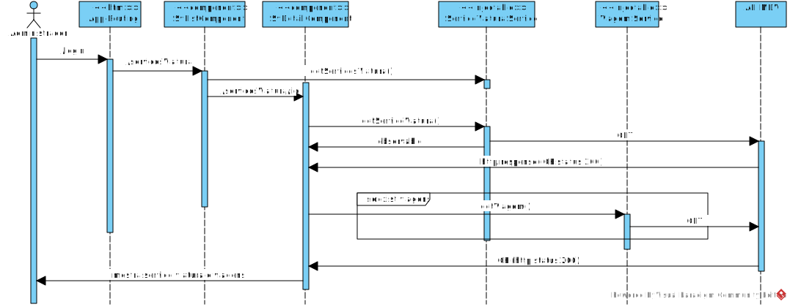

**US68 - Listar serviço de viatura**
=======================================
Como data administrator, quero listar serviço de viatura num determinado dia.

# 1. Requisitos

Pretende-se listar uma serviço de viatura com todos as viagens associadas

## 1.1 Requisitos adicionais do cliente

* `Os serviços de viatura e os serviços de tripulante não são escalonamento para dias concretos, por isso não possuem data.`

* `Como já referido mais que uma vez, serviço de viatura não tem associação com viatura e o serviço de tripulante não tem associação com tripulante`

* `notem que as viagens escolhidas para um serviço de viatura não podem ter sobreposições`

# 2. Análise

De uma lista de Serviços Viatura o utilizador escolhe um serviço 

## 2.1. Glossário de conceitos

* **Data Administrator**: utilizador do caso de uso. É ele o responsável por definir um percurso no sistema.
* **Serviço de Viatura**: Um serviço de viatura corresponde ao período de trabalho diário de uma viatura. Um serviço é definido como uma sequência de blocos de trabalho obedecendo a um conjunto de regras.
* **Viagem**: Uma viagem é a definição de horário do percurso. 

## 2.2. Modelo de domínio

n/a

## 2.3. Regras de negócio
As regras de negócio são implementadas do lado do servidor na aplicação de back-end.
 

# 3. Design

## 3.1. Realização da Funcionalidade

## 3.2. API call

### Listar Servico Viatura

* Endpoint:	`/api/servicosviatura/{idServViat}`
* Method: *GET*
* Body:
	* Media type: *application/json*
	* Type: *object*
	* Properties:
		* **id**: string (required)
		* **viagens**: string[]

Para cada viagem associada ao servico é utilizada a API MDV, para retornar
a serguinte informação no formato json

### Listar Viagens
* Endpoint:	`/api/viagens/{idViagem}`
* Method: *GET*
* Body:
	* Media type: *application/json*
	* Type: *object*
	* Properties:
	  * **id**: string
  	* **percursoId**: string
    * **descritivo**: string
    * **horaInicio**: number
    * **horaFim**: number

## 3.3. Padrões Aplicados

## 3.4. Testes

# 4. Implementação

# 5. Integração/Demonstração

# 6. Observações
