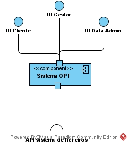
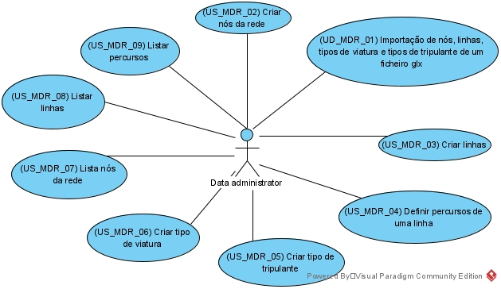
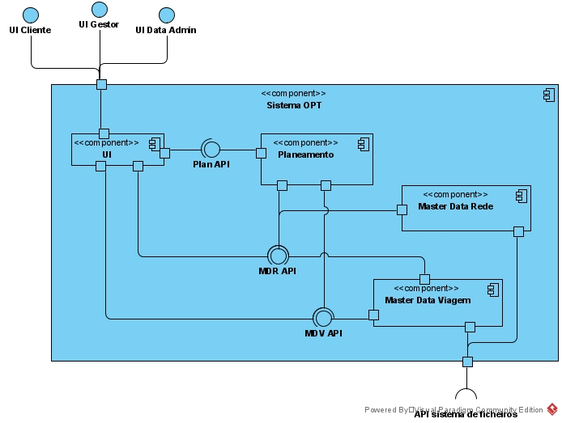
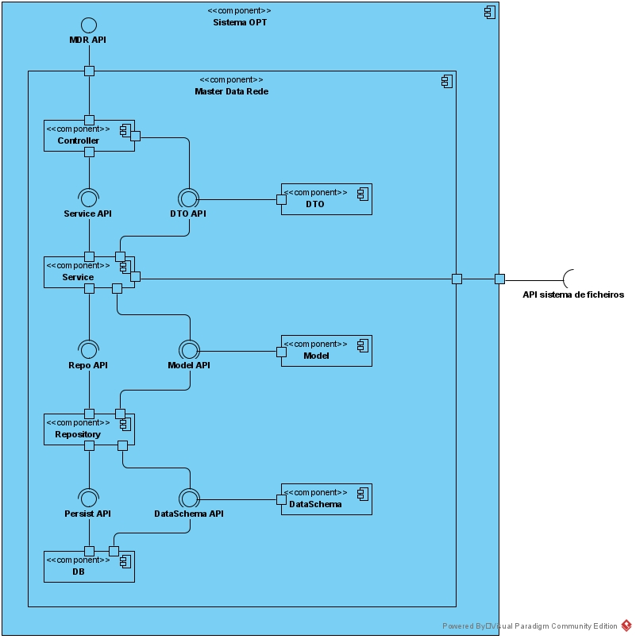
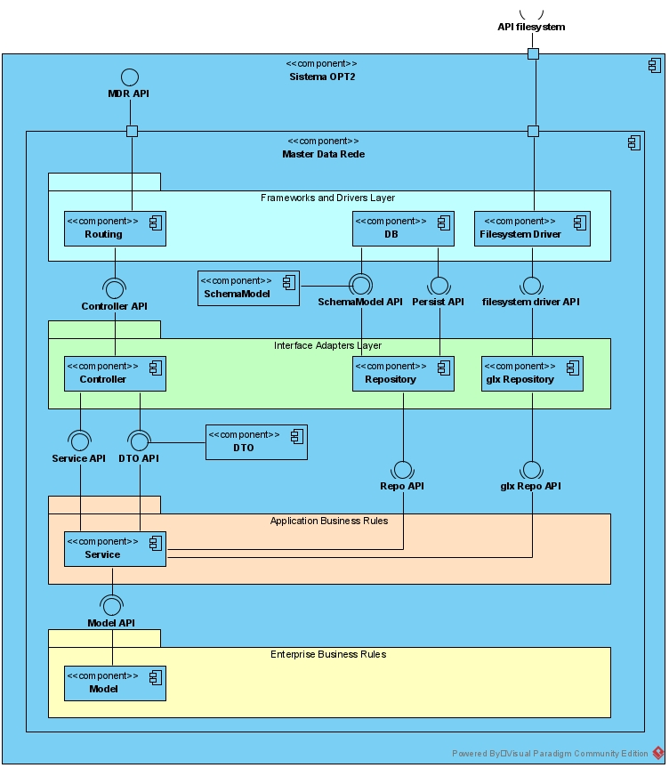
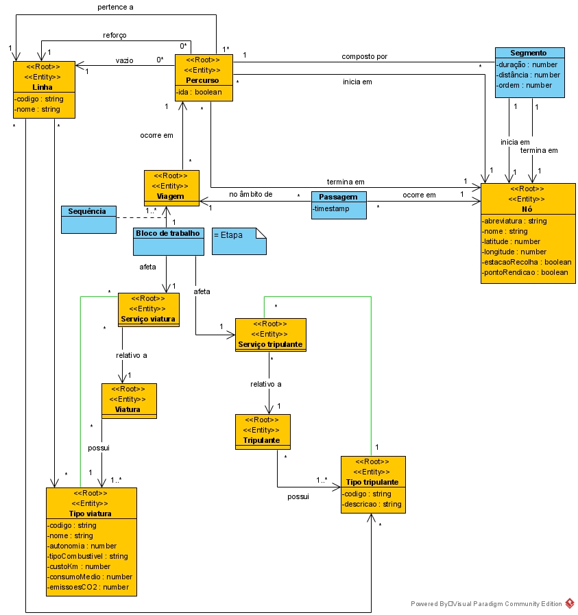

# Design Arquitetural - Modelo C4 com Vistas

## Nível 1 - Contexto do Sistema

### Vista Lógica e de Cenários

## Nível 2 - Containers

## Nível 3 - Componentes

### Master Data Rede

## Nível 4 - Classes

