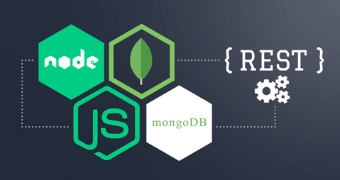
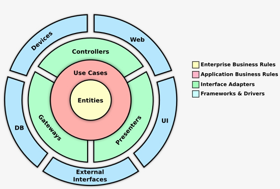
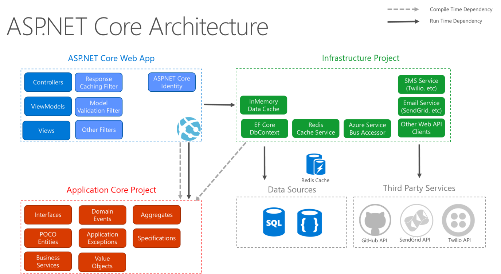
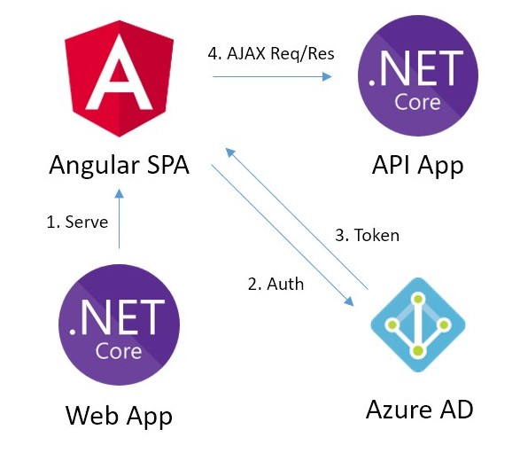

      _____    _       _                     _____   _______
     |  __ \  |_|     | |            /\     |_   _| |__   __|
     | |__) |  _    __| |   ___     /  \      | |      | |   
     |  _  /  | |  / _  |  / _ \   / /\ \     | |      | |   
     | | \ \  | | | |_| | |  __/  / ____ \   _| |_     | |   
     |_|  \_\ |_|  \__,_|  \___| /_/    \_\ |_____|    |_|   
                 __________________________
                (_________________________@)
                /  |  |  |  |  |  |  |  || `\
                |__|__|__|__|__|__|__|__||___\
                |                        | : |`'-._
               _|    .-.   <> AIT <>     | : | ,===`\
              '=|___/.-.\________________|_:_|_/.-.\|
                    \'-'/                      \'-'/
                     '-'                        '-'

# Projeto Integrador ISEP-LEI LAPR5 2020/2021 - 20S5_3NA_2

## **Índice do Projeto**

1. Módulos da App - Repositórios

    1.1. [SPA](../Project_SPA/) - [Azure Link](https://lapr5-20s5-3na-2.azurewebsites.net)

    1.2. [Master Data Rede](../Project_MDR/)

    1.3. [Master Data Viagem](./MDR/)

    1.4. [Planeamento](./Planeamento/)

2. [Wiki - Software Architecture Document (SAD)](../Project_Wiki/)

3. [Modelo de Domínio](./Docs/modelo_dominio.md)

4. [Design Arquitetural](./Docs/design_arquitetura.md)

5. Backlog - Jira Issues (turned off)

6. Requisitos Funcionais e Não Funcionais

    6.1. [Sprint A](./Docs/sprint_a_requisitos.md)

    6.2. [Sprint B](./Docs/sprint_b_requisitos.md)

    6.3. [Sprint C](./Docs/sprint_c_requisitos.md)

    6.3. [Sprint D](./Docs/sprint_d_requisitos.md)

7. [User Stories - Análise e Design](./Docs/us.md)

8. [RGPD](./Docs/RGPD)

9. [Glossário](./Docs/glossario.md)

10. [Test Coverage MDR & SPA](./Docs/Test_Coverage_Results)

## **Índice do README - Módulos MDR, SPA e Planeamento**

1. [Sistema a Desenvolver](#1-sistema-a-desenvolver)

2. [Aspetos Gerais, Arquitetura e Design do Sistema](#2-aspetos-gerais-arquitetura-e-design-do-sistema)

3. [MongoDB Atlas e Heroku do Projeto](#3-mongodb-atlas-e-heroku-do-projeto)

4. [Node.js - Tutorial, Testes, DB e Data Validation](#4-nodejs)

5. [Angular - Tutorial e Testes](#5-angular)

6. [Módulos - Outras Informações](#6-módulos-outras-informações)

    6.1. [Planeamento (modo de Utilização)](#61-planeamento-modo-de-utilização)

7. [ASP.NET Core e Azure](#7-aspnet-core)

8. [Links Úteis](#8-links-úteis)

**Nota**: Todos os ficheiros da documentação encontram-se localizados na pasta [**Docs**](./Docs).

## Constituição do Grupo de Trabalho - 20S5_3NA_2

| Nome do Aluno		|
|-------------------|
| Bruno Calisto     |
| João Pimentel     |
| Pedro Magalhães   |
| Samuel Esperança  |
| Vítor Oliveira    |

## 1. Sistema a Desenvolver
A Autoridade Intermunicipal de Transportes  (AIT) pretende um sistema de gestão e planeamento de transportes públicos que permite a gestão bem como consulta pelo público em geral de diferentes redes de transportes, linhas e viagens, bem como o planeamento dos serviços de viaturas e tripulantes a efetuar nessas linhas.

O sistema deve ser composto por uma aplicação web do tipo **Single Page Application (SPA)** que permite aos utilizadores autorizados acederem aos diferentes módulos da aplicação, bem como por um conjunto de serviços que implementem as componentes de regras de negócio necessárias para o funcionamento da aplicação web.

### 1.1. Principais Funcionalidades de Cada Módulo do Sistema

* **Master Data** – permite a gestão da informação relacionada com a rede (nós, percursos), tipos de viaturas, tipos de tripulantes, linhas e viagens.
* **Planeamento** – com base nos percursos existentes planear as trocas de tripulações nos pontos de rendição. Planear os serviços de tripulantes com base nos serviços de viatura. Consome a informação gerida no módulo master data e publica informação do planeamento para o módulo de visualização.
* **Visualizador** – permite a visualização 2D e 3D da rede, a navegação pela cena e a consulta gráfica de informação sobre as viagens. Consome a informação gerida no módulo master data e no módulo planeamento.
* **UI** – interface com o utilizador.
* **Clientes + RGPD** – gestão de informação dos utilizadores finais "clientes" e seus consentimentos no âmbito do RGPD.
Embora não esteja no âmbito atual do projeto, deve ser levado em conta na arquitetura da solução, a extensão futura para aplicações móveis. A solução deve contemplar três tipos de utilizadores:

### 1.2. Tipos de Utilizadores

* **Data Administrators** – utilizam os módulos master data.
* **Cliente** – regista-se e utiliza o módulo de visualização.
* **Gestor** – utiliza o módulo de planeamento.

> **Nota:** A administração de utilizadores pode ser efetuada diretamente na base de dados não sendo necessário um módulo de gestão de utilizadores.

## 2. Aspetos Gerais, Arquitetura e Design do Sistema

### 2.1. **MEAN**, a full stack

* **M**ongoDB -> cross-platform document database
* **E**xpress -> Node.js web framework (app structure)
* **A**ngular -> a client-side JavaScript framework (front-end)
* **N**ode.js -> the premier JavaScript web server (back-end)

### 2.2. Representational State Transfer (REST)

#### 2.2.1. RESTful web services (guiding principles)

1. Uniform interface
2. Decoupled client-server interaction
3. Stateless
4. Cacheable
5. Layered system
6. Extensible through code on demand (optional)

### 2.3. Onion Architecture

* A combinação de **DDD** e **Onion Architecture** é vantajosa.
* A combinação **Inversion of Control** (IoC) e **Dependency Inversion** é fundamental para ser ter um baixo acoplamento.
    * A implementação através do padrão **Dependency Injection** permite, por exemplo, que qualquer camada (interna) seja injetada com objetos fornecedores (das camadas externas) que cumprem a interface (por oposição a classe) aceite pela camada interna.

### 2.4. Outros padrões/princípios utilizados na implementação da generalidade das US

* **GRASP**: Controller, Creator, Information Expert, High Cohesion, Low Coupling
* **SOLID**: Single Responsibility, Dependency Inversion
* **DTO**: Data Transfer Objects

### 2.5. Single Page Application (SPA) - Angular

### 2.6. ASP.NET Core

### 2.7. .NET Core & Angular

## 3. MongoDB Atlas e Heroku do Projeto (*inactive*)

* [MongoDB Project Link](https://cloud.mongodb.com/)

* Heroku Dashboard Link's:

    * [Heroku Módulo MDR](https://dashboard.heroku.com/apps/lapr5-20s5-3na-2-mdr)

    * [Heroku Módulo MDV](https://dashboard.heroku.com/apps/lapr5-20s5-3na-2-mdv)

    * [Heroku Módulo Planeamento](https://dashboard.heroku.com/apps/lapr5-20s5-3na-2-plan)

## 4. Node.js

### 4.1. Tests

> "_Write lots of small and fast unit tests. Write some more coarse-grained tests and very few high-level tests that test your application from end to end._" - [The Practical Test Pyramid](https://martinfowler.com/articles/practical-test-pyramid.html#TheTestPyramid)

* [Jest - Testing Framework](https://jestjs.io/) -> `npm install jest`

    * [JavaScript Testing Intro Tutorial - Unit, Integration & e2e Tests](https://www.youtube.com/watch?v=r9HdJ8P6GQI)

    * [VS Code Extension - Jest Runner (Run & Debug Tests from Context-Menu/CodeLens)](https://marketplace.visualstudio.com/items?itemName=firsttris.vscode-jest-runner)

        * Troubleshooting: extension settings -> add '_MDR/package.json_' to **Config Path** & **Jest Path**

    > Type definitions for Jest -> `npm install @types/jest`

* Code Coverage HTML Report -> Run `npm test` (coverage included) or `jest --coverage`

    * Location -> ./MDR/coverage/index.html

### 4.2. DB and Data Validation

* [Mongoose - MongoDB Object Modeling](https://mongoosejs.com/) -> `npm install mongoose`

* [Joi - Data Validator for JavaScript](https://www.npmjs.com/package/joi) -> `npm install joi`

    * [Simple Joi Example](./Docs/joi_exemplo.md)

    * [Building a Middleware](https://softchris.github.io/pages/joi.html#building-a-middleware)

### 4.3. Swagger UI - Visualize and Interact With the API’s Resources

* [Express Swagger Generator](https://www.npmjs.com/package/express-swagger-generator) -> `npm install express-swagger-generator`

* Project's Link -> http://localhost:3000/api-docs

## 5. Angular

* [Tour of Heroes App and Tutorial](https://angular.io/tutorial)

* [Guide to Angular Faster Unit Tests](https://christianlydemann.com/complete-guide-to-angular-testing)

    * Run `npm test`

* Code Coverage HTML Report -> `ng test --no-watch --code-coverage`

    * Location -> ./SPA/coverage/SPA/index.html

* [Cypress e2e - Fast, easy and reliable testing for anything that runs in a browser.](https://www.cypress.io)

    * 1º - Run `npm run e2e`
    * 2º - Run `npm run cy:open` (Cypress in the interactive mode) or `npm run cy:run` (CLI mode)

## 6. Módulos (outras informações)

### 6.1. Planeamento - Modo de utilização

#### 6.1.1. Website

1. http://lapr5-20s5-3na-2.azurewebsites.net
2. Login Username -> admin
3. Password -> ***private***

#### 6.1.2. CLI

1. `npm start` (opcional, depois da implementação da cloud e heroku)
2. `swipl -f app.pl`
3. `?- load_data().`
4. `?- start(5,5,75,25,30,0,0,0,Sol,false,Warn).` 

> SWI-Prolog '-f' cmd line option -> use as initialization file instead of the default and stops SWI-Prolog from searching for a startup file.

## 7. ASP.NET Core

### 7.1. Microsoft Azure DB

URL: `https://lapr5-20s5-3na-mdv.azurewebsites.net/api`

AzureConnection: `lapr5-20s5-3na-2-mdvdb.database.windows.net`

DB Name: MDV-BD: `lapr5-20s5-3na-2-mdvdb`

Username: ***private***

Pass: ***private***

### 7.2. EF Code-First - Add/Update DB Schema (NuGet Package Manager)

| Visual Studio | VS Code |
|---------|---------|
| `Add-Migration migrationName` | `dotnet ef migrations add migrationName` |
| `Update-DataBase` | `dotnet ef database update` |

## 8. Links Úteis

* [Bulletproof node.js project architecture](https://dev.to/santypk4/bulletproof-node-js-project-architecture-4epf)

* [Node.js Best Practices](https://github.com/goldbergyoni/nodebestpractices)

* [Postman](https://www.postman.com)

* [Smart commits with Jira](https://confluence.atlassian.com/bitbucket/use-smart-commits-298979931.html) - Exemplo: *LAPR5-33 #done #comment Alteração Wiki concluído*

* [The Modern JavaScript Tutorial](https://javascript.info/)
