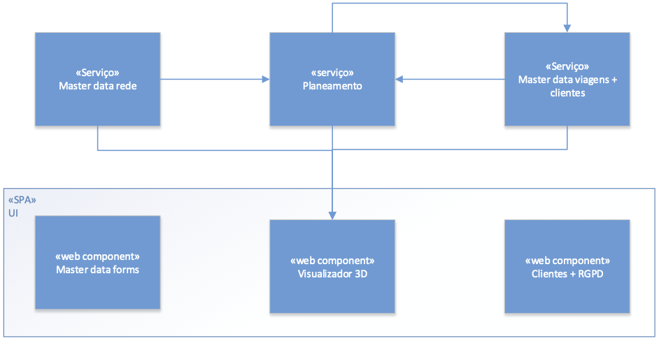

# Background da Arquitetura

## Índice
- [Background da Arquitetura](#markdown-header-background-da-arquitetura)
	- [Background do Problema](#markdown-header-background-do-problema)
		- [Visão Geral do Sistema](#markdown-header-visao-geral-do-sistema)
		- [Contexto](#markdown-header-contexto)
		- [Requisitos (Driving Requirements)](#markdown-header-requisitos-driving-requirements)
			- [Requisitos Funcionais](#markdown-header-requisitos-funcionais)
			- [Atributos de Qualidade](#markdown-header-atributos-de-qualidade)
				- [Funcionalidade](#markdown-header-funcionalidade)
				- [Usabilidade](#markdown-header-usabilidade)
				- [Confiabilidade (Reliabilidade)](#markdown-header-confiabilidade)
				- [Performance (Desempenho)](#markdown-header-performance)
				- [Suportabilidade](#markdown-header-suportabilidade)
				- [Restrições de Design](#markdown-header-restricoes-de-design)
				- [Restrições de Implementação](#markdown-header-restricoes-de-implementacao)
				- [Restrições de Interface](#markdown-header-restricoes-de-interface)
				- [Restrições Físicas](#markdown-header-restricoes-fisicas)
	- [Background da Solução](#markdown-header-background-da-solucao)
		- [Abordagens da Arquitetura](#markdown-header-abordagens-da-arquitetura)
		- [Resultados da Análise](#markdown-header-resultados-da-analise)
		- [Mapeamento de Requisitos da Arquitetura](#markdown-header-mapeamento-de-requisitos-da-arquitetura)

# Background da Arquitetura
> Architecture Background provides information about the software architecture, by:
>- describing the background and rationale for the software architecture;
>- explaining the constraints and influences that led to the current architecture;
>- describing the major architectural approaches that have been utilized in the architecture.
 
## Background do Problema
> The sub-parts of this section explain the constraints that provided the significant influence over the architecture.

### Visão Geral do Sistema
> This section describes the general function and purpose for the system or subsystem whose architecture is described in this SAD.

A Autoridade Intermunicipal de Transportes (AIT) pretende um sistema de gestão e planeamento de transportes públicos que permite a gestão bem como consulta pelo público em geral de diferentes redes de transportes, linhas e viagens, bem como o planeamento dos serviços de viaturas e tripulantes a efetuar nessas linhas.

### Contexto
> This section describes the goals and major contextual factors for the software architecture. The section includes a description of the role software architecture plays in the life cycle, the relationship to system engineering results and artifacts, and any other relevant factors.

O planeamento de transportes aborda diversas otimizações e afetações de recursos humanos e materiais com vista a cumprir o serviço de transporte pretendido bem como maximizar determinados parâmetros do operador (ex., STCP) com vista à sua eficiência operacional e financeira.
Genericamente, a oferta de transportes de um operador é o conjunto das viagens oferecidas por cada uma das suas linhas ao longo dos percursos da rede que tem mais interesse em termos de mobilidade de pessoas na área geográfica em que atua.

*NB: Contudo, o sistema aqui pedido é uma simplificação daquilo que é um sistema de gestão de transportes, pelo que são assumidas simplificações para tornar o projeto exequível neste âmbito (i.e. 5º semestre da LEI).*

Nesta edição do 5º semestre da LEI teremos a colaboração da empresa OPT – Optimização e Planeamento de Transportes, S.A. (http://opt.pt/) que atua na área de otimização e planeamento de transportes, e desenvolve sistemas informáticos que abordam a problemática tratada neste projeto.

### Requisitos (Driving Requirements)
> Esta secção enumera os requisitos funcionais, atributos de qualidade e restrições de design. Pode apontar para um documento de requisitos separado.

#### Requisitos Funcionais

##### **Master Data Rede**

1. Como data administrator, quero importar nós, percursos, linhas, tipos de viatura e tipos de tripulantes de dum ficheiro .glx.
2. Como data administrator, quero criar nós da rede indicando o seu nome, se é ou não uma estação de recolha ou ponto de rendição e as suas coordenadas.
3. Como data administrator, quero criar linha indicando o seu código (ex., “C”), nome (ex., “Linha Verde”) e os seus nós terminais (ex., Campanhã, ISMAI), bem como eventuais restrições sobre o tipo de viatura e tipo de tripulante.
4. Como data administrator, quero definir um percurso de ida/volta de uma linha. Definir os vários segmentos que constituem um percurso indicando a ordem e a distância e tempo de viagem de cada segmento.
5. Como data administrator, quero criar tipo de tripulante, ex., "motorista sénior com conhecimento de línguas estrangeiras". Um tipo de tripulante é uma descrição livre (não catalogada) de características. 
6. 	Como data administrator, quero criar tipo de viatura (ex., "minibus a gasóleo"), indicando o seu tipo de combustível (i.e., Diesel, Gasolina, Elétrico, GPL, Gás), autonomia, custo por quilómetro, consumo médio e velocidade média.
7. Como data administrator, quero listar nós de rede. O utilizador deve poder ordenar por código/nome e filtrar por código/nome (ex., todos os nós cujo nome começa por "Par") os resultados.
8. Como data administrator, quero listar linhas. O utilizador deve poder ordenar por código/nome e filtrar os resultados por código/nome (ex., todos as linhas cujo nome começa por "Par").
9. Como data administrator, quero listar percursos duma linha.

##### **Master Data Viagem**

10. Como data administrator, quero importar viagens, serviços de viatura, blocos de trabalho e serviços de tripulante de um ficheiro .glx.
11. Como data administrator, quero definir viatura.
12. Como data administrator, quero definir tripulante (nome, data de nascimento, número de carta de condução, data de validade de licença de condução) associando um ou mais tipos de tripulante.
13. Como data administrator, quero criar viagem ad hoc para uma dada linha indicando a hora de saída e o percurso.
14. Como data admnistrator quero criar as viagens para uma linha dando a hora de início, a frequência e o número de viagens, o percurso de ida e o de volta.
15. Como data administrator quero criar um serviço de viatura ad hoc.
16. Como data administrator quero criar um serviço de tripulante ad hoc.
17. Como data administrator, quero criar os blocos de trabalho de um serviço de viatura com base na duração de cada bloco e número de blocos máximos e consecutivos.
18. Como data administrator ou cliente quero listar as viagens de uma linha.
19. Como data administrator, quero listar serviço de viatura num determinado dia.
20. Como data administrator, quero listar serviço de tripulante num determinado dia.

##### **Visualização**

1. Como cliente ou gestor pretendo visualizar graficamente em 2D a rede de transportes.
2. Como cliente ou gestor pretendo controlar a visualização. Adicionar os comandos da câmara pan e zoom; o comando orbit deverá estar inativo (sugestão: botão direito do rato – pan; roda do rato – zoom).
3. Como cliente ou gestor pretendo ter uma representação da rede georreferenciada. Subpor a área geográfica (mapa) abrangida pela rede de transportes.
4. Como cliente ou gestor pretendo comutar a representação entre 2D e 3D. Adicionar um objeto de interação(por exemplo, um botão) que o permita fazer.
5. Como cliente ou gestor pretendo controlar a visualização. Na representação 3D, o comando da câmara orbit deverá estar ativo(sugestão: botão esquerdo do rato – orbit); na representação 2D deverá permanecer inativo.
6. Como cliente ou gestor pretendo visualizar modelos 3D nas estações de recolha e restantes nós. Modelar ou importar objetos3D representativos dos nós da rede e colocá-los nas posições apropriadas da cena. Cada nó da rede terá o seu próprio modelo.
7. Como data administrator pretendo selecionar o modelo3D a usar num dado nó; preferencialmente importando um ficheiro com esse modelo.
8. Como cliente ou gestor pretendo ter informação sobre os “elementos” da rede. Em ambos os modos de representação (2D e 3D), apresentar tooltips contendo informação acerca das características dos objetos(nós, linhas, percursos, etc.) apontados pelo cursor gráfico; remover os tooltips quando o cursor é afastado dos referidos objetos.
9. Como cliente ou gestor pretendo simular uma viagem pilotando uma viatura. No modo 3D, implementar a navegação na primeira pessoa (sugestão: tecla 'A' – rodar para a esquerda; tecla 'D' – rodar para a direita; tecla 'W' – avançar; tecla 'S' – recuar).
10. Como cliente ou gestor pretendo aumentar o realismo na cena. No modo 3D, adicionar iluminação e projeção de sombras.
11. Como cliente ou gestor pretendo controlar a visualização. Adicionar objetos de interação(por exemplo, botões, sliders, etc.) que permitam configurar as condições de iluminação da cena; estes objetos deverão estar ativos no modo 3D e inativos ou invisíveis no modo 2D.
12. Como cliente ou gestor pretendo aumentar o realismo da navegação na primeira pessoa. Detetar as colisões da viatura com os modelos 3D representativos dos nós da rede.

<inserir aqui o modelo de casos de uso/>

##### **Planeamento**

1. Como gestor pretendo visualizar as possibilidades de mudança de motorista/tripulação de uma linha e escolha da melhor solução de acordo com o critério do tempo. O utilizador deve poder executar o algoritmo e visualizar na UI da SPA o resultado.
    * Considerando uma rede de linhas de dimensão reduzida, criar um gerador de todas as soluções de mudança de motorista/tripulação de uma linha (num ponto de rendição ou estação de recolha) para outra/o e escolha da melhor solução de acordo com o critério do tempo.
    * Consideração da rede de linhas com pontos onde motoristas/tripulações podem mudar (pontos de rendição e estações de recolha, incluindo posicionamento no espaço Latitude-Longitude).
    * Consideração de horários nas linhas.
    * Estudo de viabilidade e complexidade do gerador de todas as soluções.
    * Estudo de heurísticas adequadas à mudança de motorista/tripulação entre estações de rendição.

2. Como gestor pretendo escolher o algoritmo a executar para posteriormente visualizar as possibilidades de mudança de motorista/tripulação de uma linha e escolha da melhor solução de acordo com o critério do tempo. O utilizador deve poder executar o algoritmo e visualizar na UI da SPA o resultado.oAplicação do Algoritmo A* sobre o problema de mudança de motorista/tripulação de uma linha/estação/ponto de rendição para outra/ooComparação do A* com o gerador de todas as soluções.

3. Como gestor pretendo visualizar as soluções de escalonamento de motoristas linha a linha usando do algoritmo de pesquisa Tabu. O utilizador deve poder executar o algoritmo e visualizar na UI da SPA o resultado.
    * Adequação de Pesquisa Tabu a problemas do tipo de escalonamento de motoristas/tripulações linha a linha.
    * Consideração de critérios de avaliação da viabilidade e qualidade das soluções geradas.
    * Estudo de critérios de avaliação da viabilidade e qualidade das soluções geradas.
    * Estudo das soluções obtidas pelos algoritmos usados em função dos parâmetros usados

4. Como gestor pretendo visualizar as soluções de escalonamento de motoristas linha a linha usando o algoritmo genético. O utilizador deve poder executar o algoritmo e visualizar na UI da SPA o resultado.
    * Adequação de Algoritmos Genéticos a problemas do tipo de escalonamento de motoristas/tripulações linha a linha. 
    * Consideração de critérios de avaliação da viabilidade e qualidade das soluções geradas.
    * Estudo de critérios de avaliação da viabilidade e qualidade das soluções geradas.
    * Estudo das soluções obtidas pelos algoritmos usados em função dos parâmetros usados.

5. Como gestor pretendo visualizar as soluções balanceadas de escalonamento de motoristas linha a linha usando o algoritmo de pesquisa Tabu.
    * Balanceamento (Equilíbrio) do trabalho entre motoristas.
    * Adaptação do Algoritmo do sprint anterior ao balanceamento obtido.

6. Como gestor pretendo visualizar as soluções balanceadas de escalonamento de motoristas linha a linha usando o algoritmo genético.
    * Balanceamento (Equilíbrio) do trabalho entre motoristas.
    * Adaptação do Algoritmo do sprint anterior ao balanceamento obtido.

<inserir aqui o modelo de casos de uso/>

##### **RGPD**

1. Como cliente final pretendo registar-me na aplicação. Apresentar o texto da informação legal devida no momento de registo de utilizadores, em conformidade com o RGPD: i) o responsável pelo tratamento dos dados ii) os dados pessoais a recolher no momento do registo de utilizador, iii) a(s) finalidade(s) desse tratamento.
2. Como cliente final pretendo dar os meus consentimentos no âmbito do RGPD no momento de registo.
3. Como cliente pretendo exercer o direito ao esquecimento.

<inserir aqui o modelo de casos de uso/>

##### **Integração**

1. A SPA deve permitir acesso a todos os módulos do sistema: master data, planeamento e visualização, bem como RGPD. Todos os módulos devem fazer parte do código fonte da mesma SPA e serem disponibilizados como um único artefacto.
2. O módulo de Planeamento deve consumir dados de rede através da API do master data.
3. O módulo de Planeamento deve consumir dados de viagens através da API do master data.
4. O módulo de Visualização deve consumir dados de rede através da API do master data.
5. O módulo de Visualização deve consumir dados de viagens através da API do master data "viagens".
6. O módulo de Visualização deve consumir dados de serviços de tripulante através da API do planeamento

<inserir aqui o modelo de casos de uso/>

##### **Desenho e operação de sistemas**

1. Como administrador da infraestrutura quero que o servidor Windows e Linux forneçam endereços IP (na segunda placa de rede) da família 192.168.X.0/24 aos postos clientes, onde X é obtido por 100 + número_do_grupo (exemplo, para o grupo 99, X=199).
2. Como administrador da infraestrutura quero que os serviços acima referidos funcionem em failover, com um deles a facultar endereços de 192.168.X.50 a 192.168.X.150 e o outro de 192.168.X.151 a 192.168.X.200.
3. Como administrador da infraestrutura quero os servidores Windows e Linux estejam disponíveis apenas para pedidos HTTP e HTTPS. Tal não deve impedir o acesso por SSH ou RDP aos administradores (o grupo). 
4. Como administrador da infraestrutura quero impedir o IP spoofing na minha rede.
5. Como administrador da infraestrutura quero que os utilizadores registados no Linux com UID entre 6000 e 6500 só consigam aceder via SSH se esse acesso for a partir de uma máquina listada em /etc/remote-hosts
6. Como administrador da infraestrutura quero que o acesso ao sistema seja inibido aos utilizadores listados em /etc/bad-guys
7. Como administrador da infraestrutura quero que as mensagens pré-login e pós-login bem sucedido sejam dinâmicas (por exemplo, “[Bom dia] | [Boa tarde] username”, etc.
8. Como administrador da infraestrutura quero que o servidor Linux responda e envie pedidos ICMP para teste de conectividade apenas e só aos computadores dos elementos do grupo.
9. Como administrador da infraestrutura quero que seja criada uma SAN iSCSI nos servidores Linux e Windows disponíveis para qualquer utilizador autenticado.
10. Como administrador da infraestrutura quero que a SAN anterior esteja disponível sem necessidade de intervenção humana após um reboot de qualquer dos servidores.
11. Como administrador do servidor Linux quero que semanalmente seja verificado se todos os utilizadores registados em /etc/passwd possuem uma entrada no /etc/shadow, se o grupo primário existe, se a homedir existe e pertence ao dono e grupo correto. Qualquer inconformidade deve ser registada em /tmp/auth_error.
12. Como administrador da infraestrutura quero que todos os utilizadores registados no DC Windows tenham a sessão bloqueada ao fim de 1 minuto de inatividade.
13. Como responsável pela infraestrutura quero que seja criado um DRP para os sistemas considerados críticos da infraestrutura que identifique e quantifique os riscos e os procedimentos para assegurar a continuidade de negócio.

<inserir aqui o modelo de casos de uso/>

#### Atributos de Qualidade
Os atributos de qualidade são categorizados e sistematizados segundo o modelo [FURPS+](https://pt.wikipedia.org/wiki/FURPS).

##### Funcionalidade
1. Cada sistema só poderá aceder aos dados que lhe dizem respeito.
2. Deve ser auditada e verificada a integridade da informação a que os sistemas acedem.
3. Com vista à necessidade de saber e necessidade de conhecer, toda a informação deve estar protegida de acessos indevidos. Ou seja, o princípio de minimização de acesso ao que é essencial para cada utilizador/aplicação, criação de túneis para transferência de informação, avaliação da integridade de dados e aplicações, e encriptação/minimização dos dados.
4. Uma vez que o módulo de gestão de encomendas se encontra virado para o exterior, é necessário ter especial atenção com a privacidade e proteção de dados à luz do RGPD. Assim é necessário que o sistema cumpra a legislação em vigor e, em especial, disponibilize as informações legais e informe o utilizador aquando do seu registo, bem como permita aceder e cancelar a sua conta nos casos e nas condições legalmente permitidas.

##### Usabilidade
5. A SPA deve permitir acesso a todos os módulos do sistema: master data, planeamento e visualização, bem como RGPD.

6. No âmbito do projeto atual, a administração de utilizadores pode ser efetuada diretamente na base de dados não sendo necessário um módulo de gestão de utilizadores.

##### Confiabilidade
n/a

##### Performance
n/a

##### Suportabilidade
7. Embora não esteja no âmbito atual do projeto, deve ser levado em conta na arquitetura da solução, a extensão futura para aplicações móveis.

##### Restrições de Design
8. O sistema deve ser composto por uma aplicação web do tipo Single Page Application (SPA) que permite aos utilizadores autorizados acederem aos diferentes módulos da aplicação, bem como por um conjunto de serviços que implementem as componentes de regras de negócio necessárias para o funcionamento da aplicação web.

<!--  -->

De um modo geral, as principais funcionalidades de cada módulo são as seguintes:

- Master data – permite a gestão da informação relacionada com a rede (nós, percursos), tipos de viaturas, tipos de tripulantes, linhas e viagens.
- Planeamento – com base nos percursos existentes planear as trocas de tripulações nos pontos de rendição. Planear os serviços de tripulantes com base nos serviços de viatura. Consome a informação gerida no módulo master data e publica informação do planeamento para o módulo de visualização.
- Visualizador 3D – permite a visualização 2D e 3D da rede, a navegação pela cena e a consulta gráfica de informação sobre as viagens. Consome a informação gerida no módulo master data e no módulo
- UI – interface com o utilizador
- Clientes + RGPD – gestão de informação dos utilizadores finais “clientes” e seus consentimentos no âmbito do RGPD

9. No âmbito do projeto atual, a administração de utilizadores pode ser efetuada diretamente na base de dados não sendo necessário um módulo de gestão de utilizadores.

10. Embora não esteja no âmbito atual do projeto, deve ser levado em conta na arquitetura da solução, a extensão futura para aplicações móveis.

##### Restrições de Implementação
11. Todos os módulos devem fazer parte do código fonte da mesma SPA e serem disponibilizados como um único artefacto.

##### Restrições de Interface
12. A SPA deve permitir acesso a todos os módulos do sistema: master data, planeamento e visualização, bem como RGPD. (repetida porque diz respeito a duas categorias)
13. O módulo de Planeamento deve consumir dados de rede através da API do master data
14. O módulo de Planeamento deve consumir dados de viagens através da API do master data
15. O módulo de Visualização deve consumir dados de rede através da API do master data
16. O módulo de Visualização deve consumir dados de viagens através da API do master data "viagens"
17. O módulo de Visualização deve consumir dados de serviços de tripulante através da API do planeamento

[...]

##### Restrições Físicas
18. Existem dois servidores em load balancing, onde estão instaladas as aplicações, serviços e as bases de dados e que se encarregam do armazenamento da informação.

19. Existem ainda dois servidores em failover que distribuem os endereços a todos os sistemas e se encarregam da autenticação de sistemas e utilizadores (DHCP, DNS (se aplicável) e autenticação de servidores, e eventualmente um servidor Kerberos).
20. Algumas das aplicações devem ser implantadas *on premises* e outras em IaaS e PaaS (*on cloud*). Cf. requisitos específicos das UC por sprint.

## Background da Solução
> The sub-parts of this section provide a description of why the architecture is the way that it is, and a convincing argument that the architecture is the right one to satisfy the behavioral and quality attribute goals levied upon it.

### Abordagens da Arquitetura
> This section provides a rationale for the major design decisions embodied by the software architecture. It describes any design approaches applied to the software architecture, including the use of architectural styles or design patterns, when the scope of those approaches transcends any single architectural view. The section also provides a rationale for the selection of those approaches. It also describes any significant alternatives that were seriously considered and why they were ultimately rejected. The section describes any relevant COTS issues, including any associated trade studies.

Baseado nos requisitos não funcionais e restrições de design, serão adotadas as seguintes abordagens/padrões/estilos:

- Client-Server, porque cada um dos "módulos" MDR, MDV, Planeamento são aplicações servidoras de outras aplicações clientes (e.g. MDR é servidor de MDV e UI, MDV é servidor de Planeamento e UI, e Planeamento é servidor de UI);
- Web Application, em que o frontend é desempenhado por uma SPA (Single Page Application), e que o backend é desempenhado pelos módulos MDR, MDV e Planeamento;
- SOA, porque os servidores (cf. anterior) deverão disponibilizar API, e particularmemte API para serem usadas na web, disponibilizados serviços para os clientes respetivos. Serão adotados os nível 0, 1 e 2 do [Modelo de Maturidade de Richardson](https://martinfowler.com/articles/richardsonMaturityModel.html) aplicado a REST;
- N-Tier, pois as várias aplicações devem ser implantadas em diferentes máquinas *on premises* e IaaS e PaaS (*on cloud*), de acordo com os requisitos não funcionais;
- Layered architecture, mais especificamente Onion Architecture, por razões académicas.

Outras abordagens/estilos/padrões, como e.g. interligação entre aplicações baseado em mensagens-eventos foram desconsideradas para não violar os requisitos e restrições definidos, mas também por questões académicas.

### Resultados da Análise
> This section describes the results of any quantitative or qualitative analyses that have been performed that provide evidence that the software architecture is fit for purpose. If an Architecture Tradeoff Analysis Method evaluation has been performed, it is included in the analysis sections of its final report. This section refers to the results of any other relevant trade studies, quantitative modeling, or other analysis results.

Não existem por agora resultados de análise ou avaliação. Estudos qualitativos acerca dos estilos/padrões adotados (nomeadamente Onion em MDR e MDV, mas também Dependency Injection na UI), permitem empiricamente advogar que a manutenibilidade, evolutabilidade e testabilidade do software são elevadas, ao mesmo tempo que permitem atingir as funcionalidades desejadas.

### Mapeamento de Requisitos da Arquitetura
> This section describes the requirements (original or derived) addressed by the software architecture, with a short statement about where in the architecture each requirement is addressed.

TBD
