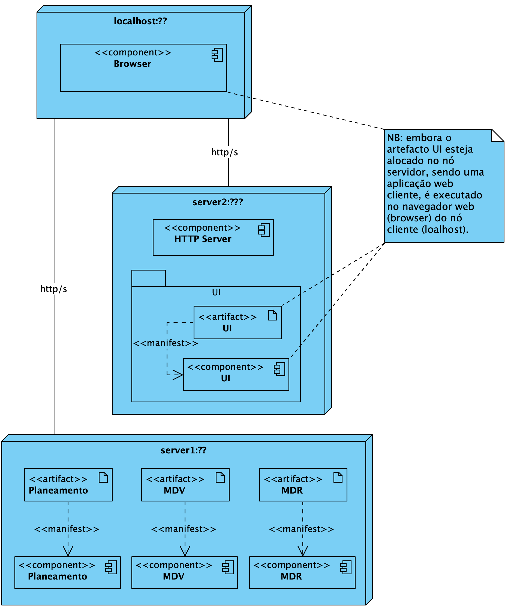

# Mapeamento entre Vistas

## Índice
- [Mapeamento entre Vistas](#markdown-header-mapeamento-entre-vistas)
	- [Nível 1](#markdown-header-nivel-1)
		- [Vista Lógica - Vista de Implementação](#markdown-header-11-vista-logica-vista-de-implementacao)
		- [Vista de Implementação - Vista Física](#markdown-header-12-vista-de-implementacao-vista-fisica)
	- [Nível 2](#markdown-header-nivel-2)
		- [Vista Lógica - Vista de Implementação](#markdown-header-21-vista-logica-vista-de-implementacao)
		- [Vista de Implementação - Vista Física](#markdown-header-22-vista-de-implementacao-vista-fisica)
	- [Nível 3 (MDR)](#markdown-header-nivel-3-mdr)
		- [Vista Lógica - Vista de Implementação](#markdown-header-31a-vista-logica-vista-de-implementacao)
		- [Vista de Implementação - Vista Física](#markdown-header-32a-vista-de-implementacao-vista-fisica)
	- [Nível 3 (UI)](#markdown-header-nivel-3-ui)
		- [Vista Lógica - Vista de Implementação](#markdown-header-31b-vista-logica-vista-de-implementacao)
		- [Vista de Implementação - Vista Física](#markdown-header-32b-vista-de-implementacao-vista-fisica)
	- [Nível 3 (MDV)](#markdown-header-nivel-3-mdv)
		- [Vista Lógica - Vista de Implementação](#markdown-header-31c-vista-logica-vista-de-implementacao)
		- [Vista de Implementação - Vista Física](#markdown-header-32c-vista-de-implementacao-vista-fisica)
	- [Nível 3 (Planeamento)](#markdown-header-nivel-3-planeamento)
		- [Vista Lógica - Vista de Implementação](#markdown-header-31d-vista-logica-vista-de-implementacao)
		- [Vista de Implementação - Vista Física](#markdown-header-32d-vista-de-implementacao-vista-fisica)

# Mapeamento entre Vistas

## Nível 1
### 1.1. Vista Lógica - Vista de Implementação

n/a

### 1.2. Vista de Implementação - Vista Física

n/a

## Nível 2
### 2.1. Vista Lógica - Vista de Implementação 

### 2.2. Vista de Implementação - Vista Física

## Nível 3 (MDR)
### 3.1a. Vista Lógica - Vista de Implementação
TBD

### 3.2a. Vista de Implementação - Vista Física
TBD

## Nível 3 (UI)
### 3.1b. Vista Lógica - Vista de Implementação
TBD

### 3.2b. Vista de Implementação - Vista Física
TBD

## Nível 3 (MDV)
### 3.1c. Vista Lógica - Vista de Implementação
TBD

### 3.2c. Vista de Implementação - Vista Física
TBD

## Nível 3 (Planeamento)
### 3.1d. Vista Lógica - Vista de Implementação
TBD

### 3.2d. Vista de Implementação - Vista Física
TBD