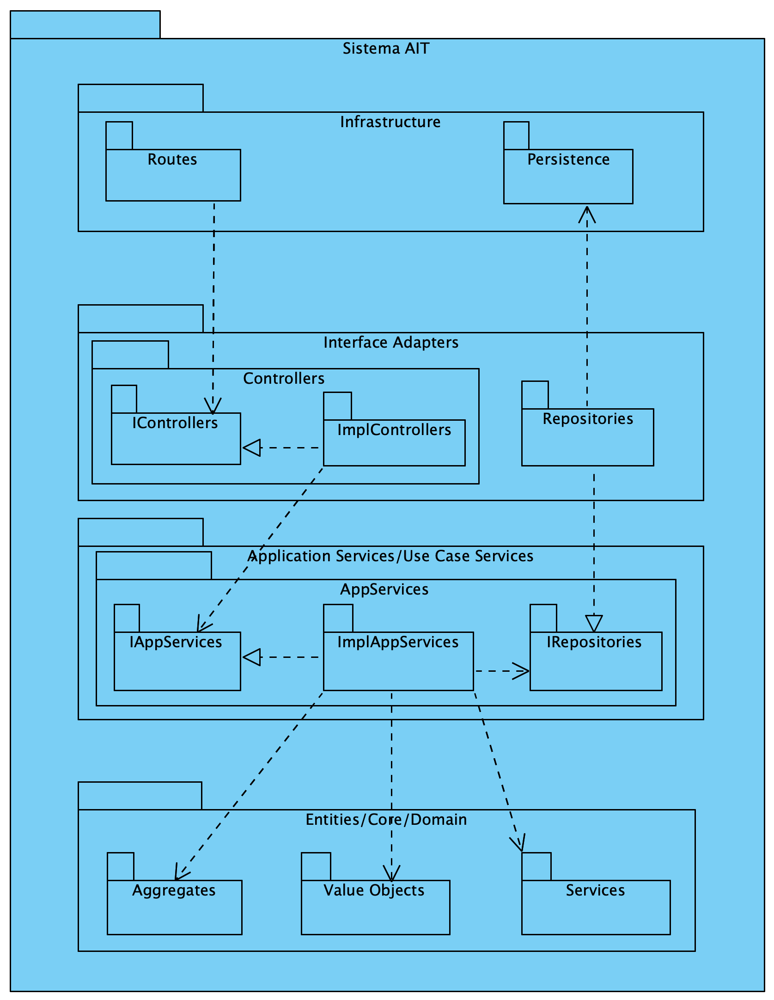

# Vistas

## Índice
- [Vistas](#markdown-header-vistas)
	- [Introdução](#markdown-header-introducao)
	- [Nível 1](#markdown-header-nivel-1)
		- [Vista Lógica](#markdown-header-11-vista-logica)
		- [Vista de Processos](#markdown-header-12-vista-de-processos)
			- [SSD US1](#markdown-header-ssd-us1)
			- [SSD US2](#markdown-header-ssd-us2)
			- (outros SSD arquiteturalmente relevantes)
	- [Nível 2](#markdown-header-nivel-2)
		- [Vista Lógica](#markdown-header-21-vista-logica)
		- [Vista de Processos](#markdown-22-header-vista-de-processos)
			- [SSD US13 (Porquê esta US?)](#markdown-header-ssd-us13)
			- (outros SSD arquiteturalmente relevantes)
		- [Vista de Implementação](#markdown-header-23-vista-de-implementacao)
		- [Vista Física](#markdown-header-24-vista-fisica)
	- [Nível 3 (MDR)](#markdown-header-nivel-3-mdr)
		- [Vista Lógica](#markdown-header-31a-vista-logica)
		- [Vista de Processos](#markdown-header-32a-vista-de-processos)
			- [SD US01](#markdown-header-sd-us01)
			- outros SSD arquiteturalmente relevantes
		- [Vista de Implementação](#markdown-header-33a-vista-de-implementacao)
		- [Vista Física](#markdown-header-34a-vista-fisica)
	- [Nível 3 (UI)](#markdown-header-nivel-3-ui)
		- [Vista Lógica](#markdown-header-31b-vista-logica)
		- [Vista de Processos](#markdown-header-32b-vista-de-processos)
		- [Vista de Implementação](#markdown-header-33b-vista-de-implementacao)
		- [Vista Física](#markdown-header-34b-vista-fisica)
	- [Nível 3 (MDV)](#markdown-header-nivel-3-mdv)
		- [Vista Lógica](#markdown-header-31c-vista-logica)
		- [Vista de Processos](#markdown-header-32c-vista-de-processos)
		- [Vista de Implementação](#markdown-header-33c-vista-de-implementacao)
		- [Vista Física](#markdown-header-34c-vista-fisica)
	- [Nível 3 (Planeamento)](#markdown-header-nivel-3-planeamento)
		- [Vista Lógica](#markdown-header-31d-vista-logica)
		- [Vista de Processos](#markdown-header-32d-vista-de-processos)
		- [Vista de Implementação](#markdown-header-33d-vista-de-implementacao)
		- [Vista Física](#markdown-header-34d-vista-fisica)

# Vistas

## Introdução
Será adotada a combinação de dois modelos de representação arquitetural: C4 e 4+1.

O Modelo de Vistas 4+1 [[Krutchen-1995]](References.md#Kruchten-1995) propõe a descrição do sistema através de vistas complementares permitindo assim analisar separadamente os requisitos dos vários stakeholders do software, tais como utilizadores, administradores de sistemas, project managers, arquitetos e programadores. As vistas são deste modo definidas da seguinte forma:

- Vista lógica: relativa aos aspetos do software visando responder aos desafios do negócio;
- Vista de processos: relativa ao fluxo de processos ou interações no sistema;
- Vista de desenvolvimento: relativa à organização do software no seu ambiente de desenvolvimento;
- Vista física: relativa ao mapeamento dos vários componentes do software em hardware, i.e. onde é executado o software;
- Vista de cenários: relativa à associação de processos de negócio com atores capazes de os espoletar.

O Modelo C4 [[Brown-2020]](References.md#Brown-2020)[[C4-2020]](References.md#C4-2020) defende a descrição do software através de quatro níveis de abstração: sistema, contentor, componente e código. Cada nível adota uma granularidade mais fina que o nível que o antecede, dando assim acesso a mais detalhe de uma parte mais pequena do sistema. Estes níveis podem ser equiparáveis a mapas, e.g. a vista de sistema corresponde ao globo, a vista de contentor corresponde ao mapa de cada continente, a vista de componentes ao mapa de cada país e a vista de código ao mapa de estradas e bairros de cada cidade.
Diferentes níveis permitem contar histórias diferentes a audiências distintas.

Os níveis encontram-se definidos da seguinte forma:
- Nível 1: Descrição (enquadramento) do sistema como um todo;
- Nível 2: Descrição de contentores do sistema;
- Nível 3: Descrição de componentes dos contentores;
- Nível 4: Descrição do código ou partes mais pequenas dos componentes (e como tal, não será abordado neste DAS/SAD).

Pode-se dizer que estes dois modelos se expandem ao longo de eixos distintos, sendo que o Modelo C4 apresenta o sistema com diferentes níveis de detalhe e o Modelo de Vista 4+1 apresenta o sistema de diferentes perspetivas. Ao combinar os dois modelos torna-se possível representar o sistema de diversas perspetivas, cada uma com vários níveis de detalhe.

Para modelar/representar visualmente, tanto o que foi implementado como as ideias e alternativas consideradas, recorre-se à Unified Modeling Language (UML) [[UML-2020]](References.md#UML-2020) [[UMLDiagrams-2020]](References.md#UMLDiagrams-2020).

## Nível 1
### 1.1. Vista Lógica

### 1.2. Vista de Processos
#### SSD US1

#### SSD US2

#### (outros SSD arquiteturalmente relevantes)
[...]

## Nível 2
### 2.1. Vista Lógica

### 2.2. Vista de Processos

#### SSD US13
(Porquê esta US?)
TBD

#### (outros SSD arquiteturalmente relevantes)
[...]

### 2.3. Vista de Implementação

### 2.4. Vista Física

Uma proposta muito simplificada. 

De facto, deve-se ter em consideração os requisitos não funcionais ["Physical Contraints"](Background.md#Physical_Constraints).

## Nível 3 (MDR)
### 3.1a. Vista Lógica
Alternativa baseada numa arquitetura por camadas sobrepostas:

Alternativa baseada numa arquitetura por camadas concêntricas (Onion):

A alternativa Onion será a adotada.

### 3.2a. Vista de Processos

#### SD US01
TBD

#### (outros SSD arquiteturalmente relevantes)
[...]

### 3.3a. Vista de Implementação

Alguns detalhes mais (se existissem pais do que 4 níveis, podia ser considerado nível 4):

### 3.4a. Vista Física

Por agora, não existe necessidade de ser representada.

## Nível 3 (UI)
### 3.1b. Vista Lógica
TBD

### 3.2b. Vista de Processos
TBD

### 3.3b. Vista de Implementação
TBD

### 3.4b. Vista Física
TBD

## Nível 3 (MDV)
### 3.1c. Vista Lógica
Alternativa baseada numa arquitetura por camadas sobrepostas:

Alternativa baseada numa arquitetura por camadas concêntricas (Onion):

A alternativa Onion será a adotada.

### 3.2c. Vista de Processos
TBD

### 3.3c. Vista de Implementação
TBD

### 3.4c. Vista Física
TBD

## Nível 3 (Planeamento)
### 3.1d. Vista Lógica
TBD

### 3.2d. Vista de Processos
TBD

### 3.3d. Vista de Implementação
TBD

### 3.4d. Vista Física
TBD