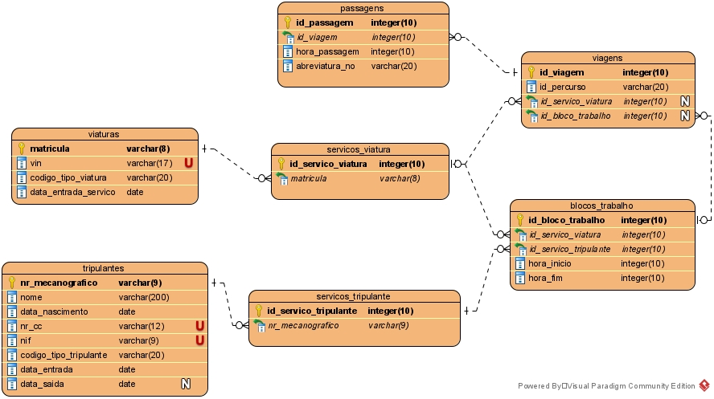

**Base de dados MDV em SQL**
=======================================

## 1. Modelo relacional de entidades

## 2. Requisitos

Deve lidar com os vários requisitos associados a cada Caso de Uso da aplicação MDV. Estes requisitos estão identificados para cada entidade abordada em cada Caso de Uso e podem ser consultados nos docs (Análise e Design) associados aos mesmos.

## 3. Decisões de implementação

### passagens
* A coluna *hora_passagem* da tabela **passagens** é representada em segundos, através de um número inteiro positivo.

### viagens
* Considerou-se que a tabela **viagens** não precisa de ter uma coluna *hora_inicial*, uma vez que, para efeitos de consulta, esse valor será o mesmo que a *hora_passagem* da tabela **passagens** no primeiro nó do percurso associado a essa viagem (através do *id_percurso*).

### blocos_trabalho
* A coluna *hora_inicio* e *hora_fim* da tabela **blocos_trabalho** são representadas em segundos, através de um número inteiro positivo.

### blocos_trabalho_viagens
* Atendendo ao requisito de que uma viagem pode estar associada a mais do que um bloco de trabalho, optou-se pela criação de uma tabela **blocos_trabalho_viagens** que representa as ligações entre **blocos_trabalho** e **viagens**.

### tripulantes
* A coluna *data_saida* da tabela **tripulantes** pode ser nula, já que esta só é atribuída aquando da saída do tripulante da empresa.
* Consideraram-se as colunas *nr_cc* e *nif* da tabela **tripulantes** como tendo restrições Unique, uma vez que no mundo real é aquilo que se verifica (pode-se assim evitar potenciais erros).

### viaturas
* Considerou-se a coluna *vin* da tabela **viaturas** como tendo restrição Unique, uma vez que no mundo real é aquilo que se verifica (pode-se assim evitar potenciais erros).

### 3.1. Representação de tempos/instantes
* A decisão de representar as horas como números inteiros e não como data ou timestamp, por exemplo, prende-se com o facto de se considerar que o planeamento se repete de igual forma para todos os dias. As horas em segundos representam assim a hora em acada um dos dias. O facto de serem um inteiro facilita a portabilidade dos dados através das várias APIs do sistema.
