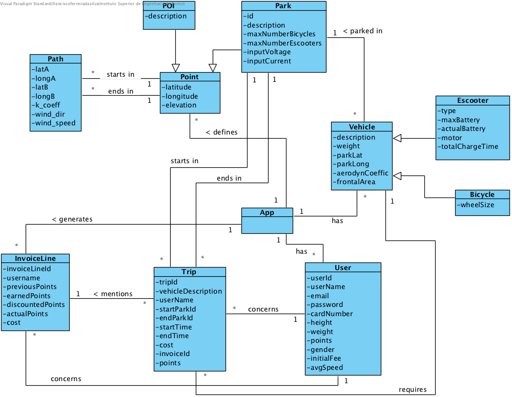
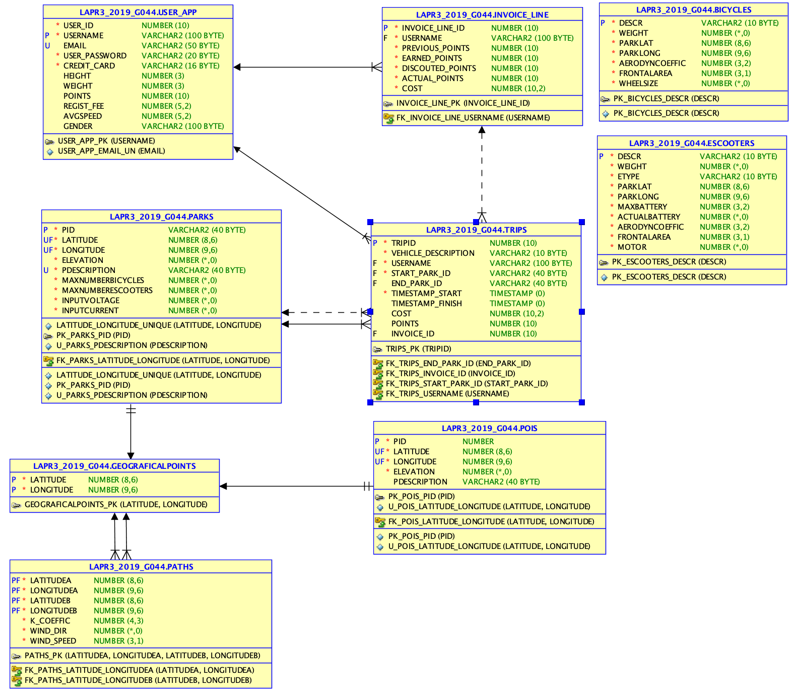

# Project Readme #

This project assignment is about the development of a Java software, that supports ride-sharing businesses, according to concepts of analysis, modelling and object-oriented programming. This service supports managing users, bicycles, electric scooters, parks and pickup and return process.

## Team Members ##

* Cunha, J.
* Machado, J.
* Pimentel, J.
* Silva, F.

## Documentation Files ##

All documentation files (including images) are located in [documentation folder](./documentation/).
- [Project Assignment](documentation/Assignment.md)

## Documentation Index ##

1. [Requirements Engineering](./documentation/Requirements.md)
    1. [Use Cases Diagram](./documentation/DUC.png)
    2. [System Sequence Diagrams (SSD)](./documentation/Requirements.md)
2. [Domain Model](./documentation/DM_v2.png)
3. [Engineering Design](./documentation/OODesign.md)
    1. [Class Diagrams (CD)](./documentation/ClassDiagrams.md)
    2. [Sequence Diagrams (SD)](./documentation/SequenceDiagrams.md)
    3. [Entity Relationship Diagram (Normalized)](./documentation/ERD.png)


## Domain Model (DM) ##



## Entity Relationship Diagram ##



## References ##

### Mockito ###

Tasty mocking framework for unit tests in Java: https://site.mockito.org/

Mockito tutorial: https://www.baeldung.com/mockito-series

Getting started with Mockito: https://www.baeldung.com/mockito-annotations

### JGraphT ###

Overview for Application Developers: https://jgrapht.org/guide/UserOverview#graph-algorithms

Shortest-path related algorithms: https://jgrapht.org/javadoc/org/jgrapht/alg/shortestpath/package-summary.html

### Jira Documentation ###

Quick overview for everything that you can do with an issue: https://confluence.atlassian.com/jiracoreserver073/working-with-issues-861257307.html

### Physics ###

Tipler, P. and Mosca, G. (2004). Physics For Scientists And Engineers. New York, NY: W.H. Freeman.

-----------------------

## Notes ##

## How do I use Maven? ##

### How to run unit tests? ###

Execute the "test" goals.
`$ mvn test`

### How to generate the javadoc for source code? ###

Execute the "javadoc:javadoc" goal.

`$ mvn javadoc:javadoc`

This generates the source code javadoc in folder "target/site/apidocs/index.html".

### How to generate the javadoc for test cases code? ###

Execute the "javadoc:test-javadoc" goal.

`$ mvn javadoc:test-javadoc`

This generates the test cases javadoc in folder "target/site/testapidocs/index.html".

### How to generate Jacoco's Code Coverage Report? ###

Execute the "jacoco:report" goal.

`$ mvn test jacoco:report`

This generates a jacoco code coverage report in folder "target/site/jacoco/index.html".

### How to generate PIT Mutation Code Coverage? ###

Execute the "org.pitest:pitest-maven:mutationCoverage" goal.

`$ mvn test org.pitest:pitest-maven:mutationCoverage`

This generates a PIT Mutation coverage report in folder "target/pit-reports/YYYYMMDDHHMI".

### How to combine different maven goals in one step? ###

You can combine different maven goals in the same command. For example, to locally run your project just like on jenkins, use:

`$ mvn clean test jacoco:report org.pitest:pitest-maven:mutationCoverage`

### How to perform a faster pit mutation analysis ###

Do not clean build => remove "clean"

Reuse the previous report => add "-Dsonar.pitest.mode=reuseReport"

Use more threads to perform the analysis. The number is dependent on each computer CPU => add "-Dthreads=4"

Temporarily remove timestamps from reports.

Example:

`mvn test jacoco:report org.pitest:pitest-maven:mutationCoverage -DhistoryInputFile=target/fasterPitMutationTesting-history.txt -DhistoryOutputFile=target/fasterPitMutationTesting-history.txt -Dsonar.pitest.mode=reuseReport -Dthreads=4 -DtimestampedReports=false`

# Oracle repository #

If you get the following error:

```
[ERROR] Failed to execute goal on project 
bike-sharing: Could not resolve dependencies for project 
lapr3:bike-sharing:jar:1.0-SNAPSHOT: 
Failed to collect dependencies at 
com.oracle.jdbc:ojdbc7:jar:12.1.0.2: 
Failed to read artifact descriptor for 
com.oracle.jdbc:ojdbc7:jar:12.1.0.2: 
Could not transfer artifact 
com.oracle.jdbc:ojdbc7:pom:12.1.0.2 
from/to maven.oracle.com (https://maven.oracle.com): 
Not authorized , ReasonPhrase:Authorization Required. 
-> [Help 1]
```

Follow these steps:

https://blogs.oracle.com/dev2dev/get-oracle-jdbc-drivers-and-ucp-from-oracle-maven-repository-without-ides

You do not need to set a proxy.

You can use existing dummy Oracle credentials available at http://bugmenot.com.
