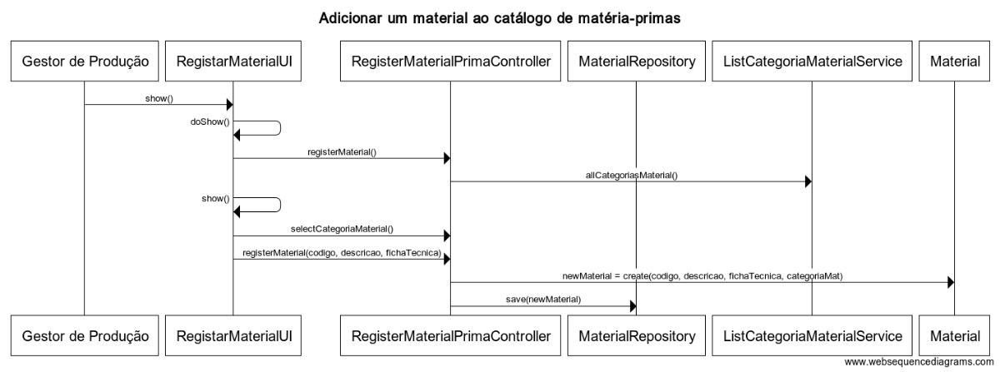

**US2001**
================

# 1. Requisitos

**2001** - Como Gestor de Produção, eu pretendo adicionar uma matéria-prima ao catálogo.

A implementação desta user story não requer uma divisão em mais casos de uso.

# 2. Análise

## 2.1. Conceitos e Contexto
* **Gestor de Produção**: utilizador da user story. Responsável por aceder ao sistema para adicionar um material ao catálogo de materiais.
* **Material**: corresponde a um item usado como **Matéria-Prima** para a produção de um **Produto**.

## 2.1.1. Caracterização de Material:
* **Código Interno**, um código único de identificação.
* **Categoria**, por exemplo, plásticos, cortiças, vernizes;
* **Descrição** simples;
* **Ficha Técnica** (documento pdf).

## 2.2. Regras de negócio / Outros requisitos

* O código interno de material é alfanuméricos (15 caracteres máximo) e único. A semântica é dada pelo utilizador do sistema que o introduz.

* As categorias são apresentadas ao utilizador para este selecionar uma no momento em que adiciona um novo material. Pelo que já deverão constar no sistema (US2002), no mínimo 1 categoria.

* Sobre a ficha técnica (documento pdf), trata-se de um ficheiro indicado pelo utilizador. Mais concretamente o nome e path deste, de modo a possibilitar a sua consulta posteriormente.

* As características da secção 2.1.1 são de preenchimento obrigatório.

# 3. Design

Implementação de acordo com a estrutura base da aplicação baseada em camadas.

É muito semelhante à US2006, adicionar um novo produto ao catálogo de produtos.

## 3.1. Realização da Funcionalidade

O fluxo que permite realizar esta funcionalidade pode ser descrito através do diagrama seguinte:

**Classes do domínio**:
-----------------------
* **Agregado Material** (*independente de CategoriaMaterial*)

|**Entity** |**Value Object**  |
|---------|---------|
| Material (root) | CodigoInternoMaterial |
|    | DescricaoMaterial |
|    | FichaTecnicaMaterial |

* **Controlador**: RegisterMaterialController

* **Repositório**: MaterialRepository

## 3.2 Padrões Aplicados

Padrões já definidos em aspetos gerais e regras da arquitetura do projeto  (1.1).

**Visitor**: criação de uma classe _CategoriaMaterialPrinter_ com recurso a este padrão, de modo ter uma nova operação sem mudar a estrutura da classe _CategoriaMaterial_. Operação relacionada com disponibilizar as categorias existentes para seleção na definição de um novo material.

## 3.3. Testes

### 3.3.1. Testes unitários

* Testar a obrigatoriedade dos atributos definidos em 2.1.1 - NotNull/NotEmpty.
* Testar tamanho do código interno de material - 15 caracteres no máximo.

### 3.3.2. Testes Funcionais

#### Teste 1: Adicionar novo material
- Login com gp/Password1
- Selecionar Adicionar Material ao Catálogo
- Introduzir "mdp", "madeira pinho", "ficha", "files" em código interno, descrição, ficha técnica, respetivamente
- Selecionar categoria "madeira"
- Submeter e verificar registo na BD

#### Teste 2: Adicionar material repetida
- Login com gp/Password1
- Executar teste 1
- Executar novamente teste 1
- Deverá impedir a inserção por ser repetida

#### Teste 3: Adicionar material sem ficha técnica
- Login com gp/Password1
- Selecionar Adicionar Material ao Catálogo
- Introduzir "mdc", "madeira carvalho", "", "" em código interno, descrição, ficha técnica (nome e path) respetivamente
- Selecionar categoria "madeira"
- Submeter
- O sistema deve alertar que uma matéria-prima tem de ter uma ficha técnica

# 4. Implementação

A implementação da classe root Material no core do projeto tem uma relação @ManyToOne com CategoriaMaterial. Pois vários materiais podem ter a mesma categoria.

Os atributos _codigoMaterial_ e _descricaoMaterial_ são do tipo _CodigoAlfaLongo_ e _Descricao_, respetivamente. Value objects definidos de modo genérico e que também validam as regras de negócio destes atributos.

# 5. Integração/Demonstração

Para resolver a dependência desta US para com a US2002 (definir uma nova categoria) foi definido implementá-la depois de concluir a US2002.

Extensão e alteração do menu do projeto para adicionar o submenu necessário para esta funcionalidade na secção do Gestor de Produção.

Testes funcionais e unitários realizados em conformidade.

# 6. Observações

De acordo com o cliente, existe liberdade para posteriormente ser disponibilizada a opção para criar uma categoria de material nesta funcionalidade.

Esta US foi refinada após o review com o professor, depois da entrega do Sprint B.

### [**Voltar para o Índice das Funcionalidades Desenvolvidas**](../ListaFuncionalidade.md)
