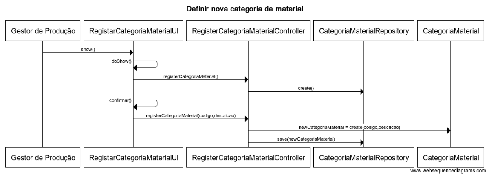

**US2002**
=======================================

# 1. Requisitos

**2002** - Como Gestor de Produção, eu pretendo definir uma nova categoria de matérias-primas.

A implementação desta user story não requer uma divisão em mais casos de uso.

# 2. Análise

A **Categoria** é uma das características fundamentais de **Material**, por exemplo, plásticos, cortiças, vernizes.

## 2.1. Glossário de conceitos e Contexto
* **Gestor de Produção**: utilizador da user story. Responsável por aceder ao sistema para definir as categorias de materiais.
* **Material**: corresponde a um item usado como **Matéria-Prima** para a produção de um **Produto**.

## 2.1.1. Caracterização de Categoria Material:
* **código de Categoria de Material**, um código único de identificação.
* **Descrição** simples;

## 2.2. Regras de negócio / Outros requisitos

* Uma categoria tem um código de categoria de material (alfanumérico com 10 caracteres no máximo e único) e uma descrição de categoria de material, campos estes de preenchimento obrigatório. A semântica é dada pelo utilizador do sistema que o introduz.

* A categoria irá depois ser apresentada ao utilizador para este selecionar uma no âmbito do US2001.

**Nota**: Após uma nova análise, optou-se por retirar a entidade CategoriaMaterial do agregado Material também, porque evita a remoção de uma categoria de material após apagar um material da BD.

# 3. Design

Implementação de acordo com a estrutura base da aplicação baseada em camadas.

## 3.1. Realização da Funcionalidade

O fluxo que permite realizar esta funcionalidade pode ser descrito através do diagrama seguinte:

**Classes do domínio**:
-----------------------
* **Agregado CategoriaMaterial** (*independente de Material*)

|**Entity** |**Value Object**  |
|---------|---------|
| CategoriaMaterial (root) | CodigoCategoriaMaterial |
|    | DescricaoCategoriaMaterial |

* **Controlador**: RegisterCategoriaMaterialController

* **Repositório**: CategoriaMaterialRepository

## 3.2. Padrões Aplicados

Padrões já definidos em aspetos gerais e regras da arquitetura do projeto  (1.1).

## 3.3. Testes Funcionais

### 3.3.1. Testes unitários

* Testar a obrigatoriedade dos atributos definidos em 2.1.1 - NotNull/NotEmpty.
* Testar tamanho do código interno de material - 10 caracteres no máximo.

### 3.3.2. Testes Funcionais

### Teste 1: Definir nova categoria de material
- Login com gp/password1
- Selecionar Definir nova Categoria Material
- Introduzir "mtl", "metal" em código e descrição, respetivamente
- Submeter e verificar registo na BD

### Teste 2: Definir categoria de material
- Login com gp/password1
- Executar teste 1
- Executar novamente teste 1
- O sistema deve impedir (categoria repetida)

### Teste 3: Definir categoria de material sem código
- Login com gp/password1
- Selecionar Definir nova Categoria Material
- Introduzir "", "mineral" em código e descrição, respetivamente
- Submeter
- O sistema deve impedir a inserção por faltar o código

# 4. Implementação

Os atributos _codigoCategoriaMaterial_ e _descricaoCategoriaMaterial_ são do tipo _CodigoAlfaCurto_ e _Descricao_, respetivamente. Value objects definidos de modo genérico e que também validam as regras de negócio destes atributos.

# 5. Integração/Demonstração

Extensão e alteração do menu do projeto para adicionar o submenu necessário para esta funcionalidade na secção do Gestor de Produção.

Testes funcionais e unitários realizados em conformidade.

# 6. Observações

Esta US foi refinada após o review com o professor, depois da entrega do Sprint B.

### [**Voltar para o Índice das Funcionalidades Desenvolvidas**](../ListaFuncionalidades.md)
