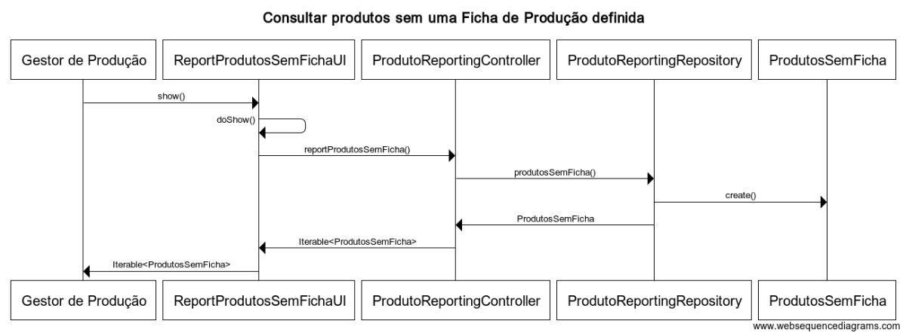
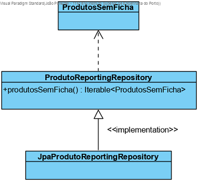

**US2003**
=======================================

# 1. Requisitos

**2003** - Como Gestor de Produção, eu quero consultar os produtos que não têm Ficha de Produção definida.

A implementação desta user story não requer uma divisão em mais casos de uso.

# 2. Análise

## 2.1. Conceitos e Contexto

* **Gestor de Produção**: utilizador da user story. Responsável por selecionar a opção para consultar a lista de produtos que não têm **Ficha de Produção** definida.

## 2.2. Outros requisitos e regras de negócio

* O resultado da consulta pode ser apresentado na consola.

# 3. Design

Implementação de acordo com a estrutura base da aplicação baseada em camadas.

## 3.1. Realização da Funcionalidade

O fluxo que permite realizar esta funcionalidade pode ser descrito através do diagrama seguinte:

**Classes de domínio**: Produto (*entity root*), CodigoComercialProduto (*value object*), DescricaoBreveProduto (*value object*) e FichaProducao (*entity do agregado Produto*)

**Controlador**: ProdutoReportingController

**Repositório**: ProdutoReportingRepository

**Reporting DTO**: ProdutosSemFicha

## 3.2. Diagrama de Classes

## 3.3. Testes Funcionais

### **Teste 1:** Consultar produtos sem ficha de produção definida

- Login com gp/Password1
- Selecionar Consultas -> Consultar Produtos Sem Ficha Produção
- O resultado deve ser a apresentação de todos os produtos sem ficha de produção inseridos pelo bootstrapper

## 3.4. Padrões Aplicados

Padrões já definidos em aspetos gerais e regras da arquitetura do projeto (1.1).

* Reporting com **DTO** (definido no 1.2. de aspetos gerais): criação de uma lista de objetos (isentos de comportamento) com todos os produtos sem ficha de produção para apresentar na camada de apresentação.

# 4. Implementação

A query personalizada para pesquisar pelo resultado na base de dados está definida na camada de persistence (*JpaProdutoReportingRepository*).

# 5. Integração/Demonstração

Só é possível realizar o teste funcional depois de implementadas as US 1006.

# 6. Observações

N/A

### [**Voltar para o Índice das Funcionalidades Desenvolvidas**](../ListaFuncionalidades.md)
