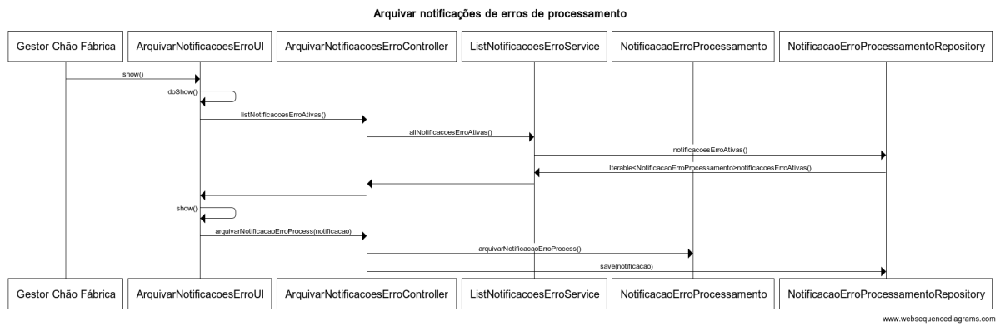
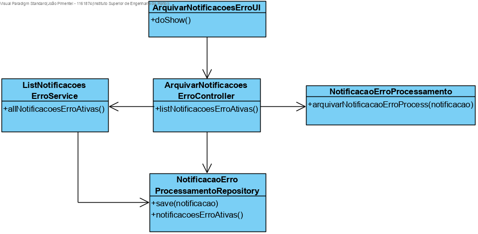

**US3006**
================

# 1. Requisitos

**3006** - Como Gestor de Chão de Fábrica, eu pretendo arquivar uma ou mais notificações de erros de processamento.

A implementação desta user story não requer uma divisão em mais casos de uso.

# 2. Análise

## 2.1. Conceitos e Contexto
* **Gestor de Chão de Fábrica**: utilizador da user story. Responsável por aceder ao sistema para arquivar uma ou mais notificações de erros de processamento.
* **Notificação Erro Processamento**: trata-se da notificação decorrente do processamento de mensagens quando está suspenso. Existem notificações (i) ativas ou não tratadas e (ii) notificações arquivadas.

## 2.2. Regras de negócio / Outros requisitos

* Algumas das notificações ativas (ver US5001) podem passar a arquivadas, resultando na alteração do estado da notificação, sendo por isso necessário persistir a alteração do estado no sistema.

# 3. Design

Implementação de acordo com a estrutura base da aplicação baseada em camadas.

## 3.1. Realização da Funcionalidade

**Classes do domínio**:

| **Entity** | **Value Object** |
|---------|---------|
| NotificacaoErroProcessamento (root) | EstadoNotificacaoErroProcessamento |
| | |

* **Controlador**: ArquivarNotificacoesErroProcessController

* **Service**: ListNotificacoesErrosService

* **Repository**: NotificacaoErroProcessamentoRepository

## 3.2. Diagrama de Classes

## 3.3 Padrões Aplicados

Padrões já definidos em aspetos gerais e regras da arquitetura do projeto (1.1).

## 3.4. Testes

### 3.4.1. Testes unitários

* Testar o método de alteração do estado da notificação de erro para 'ARQUIVADA'.

### 3.4.2. Testes Funcionais

#### Teste 1: Arquivar duas notificações de erros de processamento
- Login com gcf/Password1
- Selecionar Notificações de Erros de Processamento > Arquivar Notificações Ativas
- Selecionar uma das notificações ativas
- Submeter e verificar a alteração do estado da notificação na BD

# 4. Implementação

Recorrer ao serviço *ListNotificacoesErroService*, criado no package *SPM* e relacionado com a US3005, para listar os elementos da classe *NotificacaoErroProcessamento* que se encontram no estado ativo.

# 5. Integração/Demonstração

Realizar o teste funcional para verificar se a integração foi bem sucedida, isto é, se a notificação deixa de constar na listagem de consulta relacionada com a US3005.

# 6. Observações

N/A

### [**Voltar para o Índice das Funcionalidades Desenvolvidas**](../ListaFuncionalidades.md)
