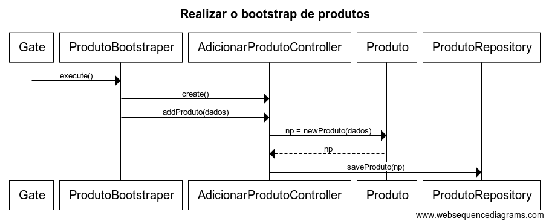

**US1006**
=======================================

# 1. Requisitos

**1006** - Como Gestor de Projeto, eu pretendo que a equipa proceda à inicialização (bootstrap) de alguns produtos.

# 2. Análise

Um produto é definido por um código de fabrico, duas descrições, breve e completa, um código comercial,uma categoria, possui um lote associado, pode ser uma matéria prima , pode ter uma ficha de produção ou não. Para alem destes, os produtos também contem informação sobre a unidade de medida.

# 3. Design

Utilizar a estrutura base standard da aplicação baseada em camadas.

## 3.1. Realização da Funcionalidade

O fluxo que permite realizar esta funcionalidade pode ser descrito através do diagrama seguinte:

**Classes do domínio**:

* Produto

**Controlador**: AdicionarProdutoController

**Repositório**: ProdutoRepository

**Bootstraper** ProdutoBootstraper

## 3.2. Diagrama de Classes

*Nesta secção deve apresentar e descrever as principais classes envolvidas na realização da funcionalidade.*

### [**Voltar para o Índice das Funcionalidades Desenvolvidas**](../ListaFuncionalidades.md)
