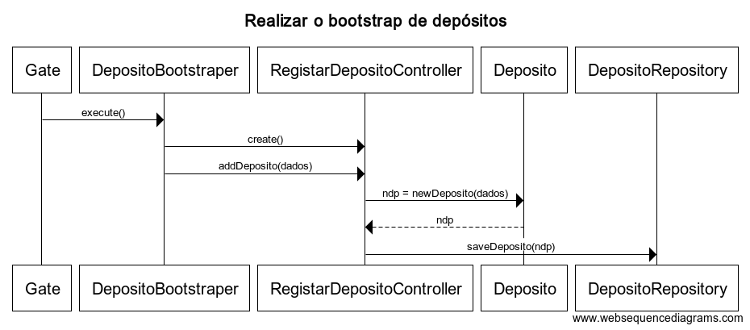

**US1009**
=======================================

# 1. Requisitos

**1009** - Como Gestor do projeto, eu pretendo que a equipa proceda à inicialização (bootstrap) de alguns Depósitos.

# 2. Análise

Um depósito é definido por uma descrição e por um código de depósito. É nos depósitos que estão guardados as Matérias-Primas e os Produtos.

# 3. Design

Utilizar a estrutura base standard da aplicação baseada em camadas.

## 3.1. Realização da Funcionalidade

O fluxo que permite realizar esta funcionalidade pode ser descrito através do diagrama seguinte:

**Classes do domínio**:

* Depósito

**Controlador**: RegistarDepositoController

**Repositório**: DepositoRepository

**Bootstraper** DepositoBootstraper

## 3.2. Diagrama de Classes

*Nesta secção deve apresentar e descrever as principais classes envolvidas na realização da funcionalidade.*

### [**Voltar para o Índice das Funcionalidades Desenvolvidas**](../ListaFuncionalidades.md)
