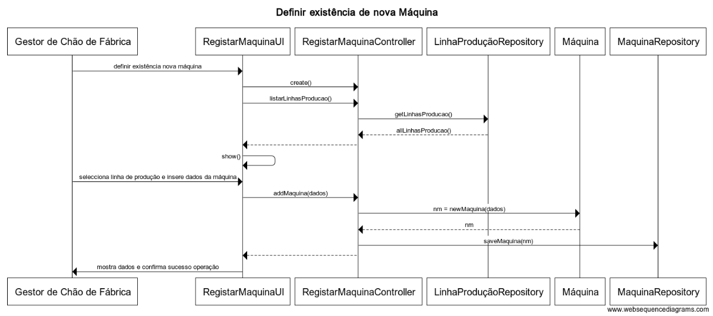

**US3001**
=======================================

# 1. Requisitos

**3001** - Como Gestor de Chão de Fábrica, eu pretendo definir a existência de uma nova máquina.

A implementação desta user story não requer uma divisão em mais casos de uso.

Tem de existir uma linha de Produção previamente criada para se poder obter o valor da sequência da máquina dentro dessa mesma linha.

# 2. Análise

## 2.1. Glossário de conceitos
* **Ficheiro de Configuração da Máquina**  Ficheiro de configuração de uma determinada **Máquina**, que não faz parte do âmbito do sistema a desenvolver.
* **Gestor de Chão de Fábrica**: utilizador da user story. Responsável por definir a existência de uma nova máquina assim como da criação de uma nova linha de produção.
*  **Linha de Produção**  Organização sequencial de um conjunto de **Máquinas**. 
* **Máquina**  É um equipamento produtivo capaz de realizar operações com vista a produzir um **Produto** e capaz de gerar **Mensagens**, e é inserida no contexto de uma linha de produção, assumindo uma posição na sequência desta. 

## 2.1.1. Caracterização da **Máquina**:
* **idMaquina**, Código Interno (alfanumérico)  -  é aquele pelo qual a **máquina** é primariamente reconhecida no sistema em desenvolvimento; ( **Código interno da Máquina**).
* **idProtocolo**, - Identificador requerido pelo protocolo de comunicação - um número inteiro, usado apenas para efeitos de comunicação.  ;
* **Descrição**, simples;
* **Data de instalação**, referente à data da instalação da máquina no chão de fábrica;
* **Marca**, referente à empresa responsável pelo fabrico da máquina;
* **Modelo**, referente à versão da máquina;
 * **iDLinhaProducao**, código único de identificação da **Linha de Produção** na qual a **Máquina** está integrada ;
 * **Sequencia**, inteiro relativo à posição que a máquina ocupa na sequência de uma dada  **Linha de Produção** .

## 2.2. Outros requisitos, invariantes e contexto

Isto está em linha com o que está descrito no documento que descreve o sistema a desenvolver (cf. transcrição abaixo):

"Especificação de máquinas: uma máquina possui um código interno, um número de série, uma descrição, uma data de instalação, uma marca e modelo.

 1. Outros atributos correlacionados com o protocolo de comunicação podem ser necessários, em particular, a existência de um outro identificador especificado pelo protocolo."

Assim, o identificador do protocolo de comunicação deve ser usado apenas nas US que envolvam comunicação entre o simulador de máquina e o nosso sistema (aplicação SCM). Esta última aplicação, deve imediatamente "traduzir" as mensagens com esse identificador para o respetivo código interno da máquina.

No resto do sistema (aplicações e US), deve ser usado o código interno de cada máquina.

As máquinas só podem pertencer a uma única linha de produção visto serem equipamentos pesados de difícil mobilidade.

As linhas de produção são apresentadas ao utilisador de forma a incorporar a máquina a definir, e de forma a obter a sua posição na sequência da linha de produção em questão.

Uma vez que as máquinas são declaradas num contexto de uma linha de produção, estas últimas têm que estar previamente registadas em sistema para que a definição da máquina seja possível.

Sobre o ficheiro de configuração da máquina, a adição deste é facultativa e não será abordado neste caso de uso.

É a maquina que conhece linha de produção e nao o contrário, de forma a melhorar a performance no processamento das mensagens, sendo que na mensagem se conhece apenas a máquina, o que melhoraria os casos de uso de processamento de máquinas.

# 3. Design

As máquinas possuem o **iDLinhaProducao**, assim como a **Sequencia** dentro de uma dada **linha de produção**.
O **idProtocolo** terá como objetivo associar um protocolo de comunicação.
O **iDLinhaProducao** terá o propósito de garantir que uma dada máquina não seja inserida em mais do que uma **linha de produção**.
As máquinas apenas poderão ter uma posição numa dada **linha de produção**, logo, não haverá mais do que uma máquina para cada posição de uma **linha de produção**.

Se uma máquina for adicionada numa posição já ocupada numa **linha de produção**, os valores de **Sequência** das máquinas seguintes são incrementados, ocupando as posições seguintes, sendo por isso optada a solução de incorporar uma linked list dentro da linha de produção para a futura obtenção do valor da sequência estar relacionado com índice dessa mesma linked list, que garante a manutenção das posições consecutivas.

## 3.1. Realização da Funcionalidade

O fluxo que permite realizar esta funcionalidade pode ser descrito através do diagrama seguinte:

**Classes do domínio**:

* Máquina(entity root do agregado Máquina)
    
	* Constituição do agregado: ID máquina (value object), Ficheiro de Configuração da Máquina (value object)
  
* Linha de Produção(entity root do agregado Linhda de Produção)

**Controlador**: RegistarMaquinaController

**Repositório**: MaquinaRepository

## 3.2. Diagrama de Classes

*Nesta secção deve apresentar e descrever as principais classes envolvidas na realização da funcionalidade.*

## 3.3. Padrões Aplicados
*Nesta secção deve apresentar e explicar quais e como foram os padrões de design aplicados e as melhores práticas*

Implementação de acordo com a estrutura base da aplicação, organizada numa arquitetura por camadas segundo o padrão *Layered Architecture*. Cada camada tem um papel específico e uma responsabilidade no contexto da aplicação.
Divisão dos packages (de cada camada) por área funcional (vertical slicing). Facilitar futuras alterações numa determinada funcionalidade, mantendo a coesão e um baixo nível de acoplamento.
**Nota**: a resumir depois do upload das regras gerais de arquitectura do sistema.

## 3.4. Testes 

**CASO 1**

* Iniciar definição de existência de nova máquina;
* Inserir dados de máquina com um ID especifico;
* Recriar máquina com o mesmo ID;
* Deverá aparecer mensagem de erro indicando que a máquina é já existente.
  
 **CASO 2**

* Iniciar definição de existência de nova máquina;
* Não inserir dados e confirmar;
* Deverá aparecer mensagem de erro a indicar que a definição da existência de nova máquina não pode ser realizada com dados por preencher.

 **CASO 3**

* Iniciar definição de existência de nova máquina;
* Não escolher linha de produção e confirmar;
* Deverá aparecer mensagem de erro a indicar que uma definição de existência de uma nova máquina tem de ser efetuada num contexto de uma linha de produção.

 **CASO 4**

* Iniciar definição de existência de nova máquina;
* Escolher linha de produção e confirmar;
* Seleccionar uma posição na sequência da linha de produção superior ao número de máquinas da mesma.
* Deverá aparecer mensagem de rro a indicar que não podem ocorrer posições vazias numa dada linha de produção.

# 4. Implementação

*Nesta secção a equipa deve providenciar, se necessário, algumas evidências de que a implementação está em conformidade com o design efetuado. Para além disso, deve mencionar/descrever a existência de outros ficheiros (e.g. de configuração) relevantes e destacar commits relevantes;*
*Apenas colocar detalhes que mereçam destaque, não colocar "coisas corriqueiras" sobre a implementação. Assumam que quem lê o vosso código sabe programar por isso apenas devemos explicar as decisões de implementação que sejam menos óbvias.*
*Codificação de acordo com o design e execução de testes de desenvolvimento (unitários e funcionais)*

*Recomenda-se que organize este conteúdo por subsecções.*

# 5. Integração/Demonstração

*Nesta secção a equipa deve descrever os esforços realizados no sentido de integrar a funcionalidade desenvolvida com as restantes funcionalidades do sistema.*
*Provavelmente haverá dependências entre esta user story e as classes de domínio e outras user stories. Devem aqui indicar como é que essas dependências foram mitigadas. Especial atenção nos casos em que se dependa de outros subsistemas ou de aplicações externas.*
*Junção do código na base de código comum do repositório, execução de testes unitários a todo o sistema. Execução dos testes funcionais principais.*

# 6. Observações

*Nesta secção sugere-se que a equipa apresente uma perspetiva critica sobre o trabalho desenvolvido apontando, por exemplo, outras alternativas e ou trabalhos futuros relacionados.*

De acordo com o cliente, existe liberdade para posteriormente ser disponibilizada a opção para criar uma categoria de matéria-prima nesta funcionalidade.

### [**Voltar para o Índice das Funcionalidades Desenvolvidas**](../ListaFuncionalidades.md)
