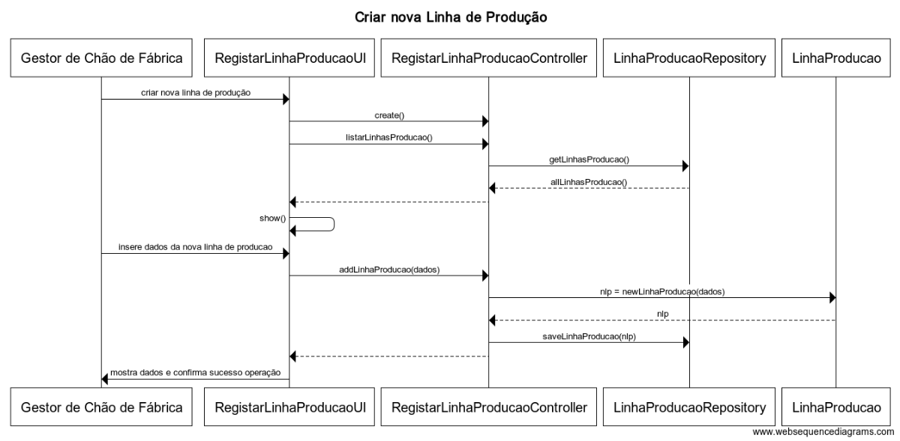

**US3002**
=======================================

# 1. Requisitos

**3002** - Como Gestor de Chão de Fábrica, eu pretendo criar uma nova linha de produção.

A implementação desta user story não requer uma divisão em mais casos de uso.

# 2. Análise

## 2.1. Glossário de conceitos

* **Gestor de Chão de Fábrica**: utilizador da user story. Responsável por definir a existência de uma nova máquina assim como da criação de uma nova linha de produção.
*  **Linha de Produção**  Organização sequencial de um conjunto de **Máquinas**. 
* **Máquina**  É um equipamento produtivo capaz de realizar operações com vista a produzir um **Produto** e capaz de gerar **Mensagens**, e é inserida no contexto de uma linha de produção, assumindo uma posição na sequência desta última. 

## 2.1.1. Caracterização da **Linha de Produção**:
* **iDLinhaProducao**, código único de identificação da **Linha de Produção** .

## 2.2. Outros requisitos, invariantes e contexto

As linhas de produção são apresentadas ao utilisador de forma a que este não repita os dados de uma linha de produção já existente.

# 3. Design

Utilizar a estrutura base standard da aplicação baseada em camadas.

Uma vez que as máquinas são declaradas num contexto de uma linha de produção, estas últimas têm que estar previamente registadas em sistema para que a definição da máquina seja possível.

## 3.1. Realização da Funcionalidade

O fluxo que permite realizar esta funcionalidade pode ser descrito através do diagrama seguinte:

**Classes do domínio**:

* Linha de Produção(entity root do agregado Máquina)
    

**Controlador**: RegisterLinhaProducaoController

**Repositório**: LinhaProducaoRepository

**Nota**: após um revisão dos requisitos, foi adicionado o Value Object **iDLinhaProducao** ao  agregado **LinhaProducao** no modelo de domínio.

## 3.2. Diagrama de Classes

*Nesta secção deve apresentar e descrever as principais classes envolvidas na realização da funcionalidade.*

## 3.3. Padrões Aplicados
*Nesta secção deve apresentar e explicar quais e como foram os padrões de design aplicados e as melhores práticas*

Implementação de acordo com a estrutura base da aplicação, organizada numa arquitetura por camadas segundo o padrão *Layered Architecture*. Cada camada tem um papel específico e uma responsabilidade no contexto da aplicação.
Divisão dos packages (de cada camada) por área funcional (vertical slicing). Facilitar futuras alterações numa determinada funcionalidade, mantendo a coesão e um baixo nível de acoplamento.
**Nota**: a resumir depois do upload das regras gerais de arquitectura do sistema.

## 3.4. Testes 

**CASO 1**

* Iniciar criação de uma nova linha de produção;
* Criar Linha de Produção inserindo um ID especifico;
* Recriar Linha de produção com mesmo ID;
* Deverá aparecer mensagem de erro indicando que a linha de produção é já existente.

# 4. Implementação

*Nesta secção a equipa deve providenciar, se necessário, algumas evidências de que a implementação está em conformidade com o design efetuado. Para além disso, deve mencionar/descrever a existência de outros ficheiros (e.g. de configuração) relevantes e destacar commits relevantes;*
*Apenas colocar detalhes que mereçam destaque, não colocar "coisas corriqueiras" sobre a implementação. Assumam que quem lê o vosso código sabe programar por isso apenas devemos explicar as decisões de implementação que sejam menos óbvias.*
*Codificação de acordo com o design e execução de testes de desenvolvimento (unitários e funcionais)*

*Recomenda-se que organize este conteúdo por subsecções.*

# 5. Integração/Demonstração

*Nesta secção a equipa deve descrever os esforços realizados no sentido de integrar a funcionalidade desenvolvida com as restantes funcionalidades do sistema.*
*Provavelmente haverá dependências entre esta user story e as classes de domínio e outras user stories. Devem aqui indicar como é que essas dependências foram mitigadas. Especial atenção nos casos em que se dependa de outros subsistemas ou de aplicações externas.*
*Junção do código na base de código comum do repositório, execução de testes unitários a todo o sistema. Execução dos testes funcionais principais.*

# 6. Observações

*Nesta secção sugere-se que a equipa apresente uma perspetiva critica sobre o trabalho desenvolvido apontando, por exemplo, outras alternativas e ou trabalhos futuros relacionados.*

De acordo com o cliente, existe liberdade para posteriormente ser disponibilizada a opção para criar uma categoria de matéria-prima nesta funcionalidade.

### [**Voltar para o Índice das Funcionalidades Desenvolvidas**](../ListaFuncionalidades.md)
