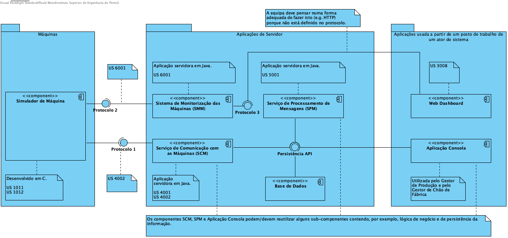

# Aspetos gerais e regras da arquitetura do projeto

## 1. Estrutura base standard da aplicação

Implementação de acordo com a estrutura base da aplicação, organizada numa **arquitetura por camadas** segundo o padrão *Layered Architecture*. Cada camada tem um papel específico e uma responsabilidade no contexto da aplicação.
Divisão dos packages (de cada camada) por área funcional (vertical slicing).

O objetivo é facilitar futuras alterações numa determinada funcionalidade, mantendo a coesão e um baixo nível de acoplamento.

O repositório selecionado consiste no *relational database* (JPA).

### 1.1. Outros padrões utilizados na implementação da generalidade das US

* GRASP: Controller, Creator, Information Expert, High Cohesion, Low Coupling
* SOLID: Single-responsibility principle
* Repository
* Factory
* Command

### 1.2. Outros padrões definidos pontualmente nas US

* **DTO**: *para transportar dados, através de um objeto, entre diferentes processos com o objetivo de reduzir o número de chamadas de métodos. Garante um baixo acoplamento entre as diferentes camadas, um desempenho elevado na transferência de dados e mais flexibilidade em futuras implementações. Utilizado, por exemplo, nas classes de consulta de objetos da BD.*

* **Singleton**: *garante acesso a uma única instância duma classe para coordenar ações através do sistema. Utilizado, por exemplo, nas classes de conceitos genéricos (ponto 2).*

* **Strategy**: *permite selecionar um algoritmo em tempo de execução, invés de implementar um único algoritmo diretamente. Utilizado, por exemplo, nas classes de importação/exportação de ficheiros.*

* **Visitor**: *possibilita acrescentar novas operações a uma "família" de classes ou objetos, sem ser necessário as modificar.*

## 2. Conceitos Genéricos

Classes criadas no sistema que estão relacionadas com conceitos genéricos, de modo a aplicar regras de negócio a value objects que partilham as mesmas.

| Conceito  | Regras |
|---------|---------|
| CodigoAlfaCurto | Cadeia de carateres alfanuméricos com uma dimensão não superior a 10 caracteres |
| CodigoAlfaLongo | Cadeia de carateres alfanuméricos com uma dimensão não superior a 15 caracteres |
| Descricao | Cadeia de carateres com uma dimensão não superior a 50 caracteres |
| DescricaoBreve | Cadeia de carateres com uma dimensão não superior a 30 caracteres |

## 3. Bootstrap
- Todas as constantes encontram-se definidas numa classe própria, *TestDataConstants* em *infrastructure.bootstrapers*.

- Classes bootstrapper representativas das classes do domínio no package *infrastructure.bootstrapers.demo*.

### 3.1. Mais informação de apoio à criação da documentação do bootstrap:

*O bootstrap irá utilizar os controladores de caso de uso desenvolvidos noutras users stories pelo que a análise consiste em identificar que dados de bootstrap são necessários e o design em decidir a divisão de organização dos bootstrappers indicando se necessário alguma particularidade. Exemplo, no projeto eCafeteria para inicializar os “dish” é necessário que já existam “dishtype” pelo que será necessário pesquisar os “dishtype” antes de registar “dish”. Para tal foram definidas constantes com os ids de dishtype que interessam para este bootstrap e sincronizou-se com o colega que estava a desenvolver o bootstrap de “dishtype” para que fossem inicializados esses objetos.*

## 4. Exportação de dados XML e validação com XSD - US1010 / US2007

Todos os ficheiros XML exportados e respetivos XSD encontram-se na pasta [**exported_files**](../exported_files/).

## 5. Test-Driven Development (TDD) e JUnit

O que testar:

* Raramente: código de UI
* Dificilmente: esquema de dados
* Habitualmente: código de negócio (BLL)

## 6. Dependências das Funcionalidades

| N1 | N2 | N3 |
| -----| ----| ---|
| 1003 |
| 2002 | 2001 | 1004
| * | 1005
| 2005 ou 2006 | 1006
| * | 2004 | 2003
| 3001 | 1007
| 3002 | 3001 | 1008
| 3003 | 1009
| 9001 |

## 7. Links úteis

* [Smart commits with Jira](https://confluence.atlassian.com/bitbucket/use-smart-commits-298979931.html)

### Exemplo smart commit:
*PROJ-33 #done #comment Alteração Wiki concluído*